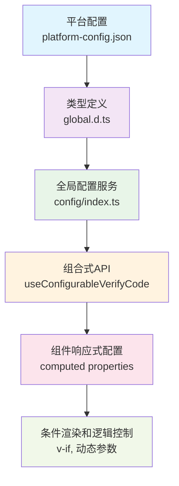

# 可配置验证码功能实现方案

## 功能概述

本功能实现了通过项目级别配置来控制验证码功能的开启与关闭，支持图片验证码和短信验证码的独立配置。采用组合式 API `useConfigurableVerifyCode` 实现，提供更好的代码复用性和维护性。

## 设计目标

1. **统一配置读取** - 使用项目统一的 `getConfig()` 函数
2. **封装组合式 API** - 将验证码配置逻辑封装为可复用的组合式函数
3. **简化组件代码** - 减少组件中的配置处理逻辑
4. **提升扩展性** - 便于后续添加新的验证码类型

## 技术架构

### 配置层级结构



## 详细实现方案

### 1. 配置文件设置

**文件**：`apps/admin/public/platform-config.json`

::: details 平台配置文件示例

<<< ./tests/basic-config-example.json

:::

**设计说明**：

- 使用嵌套对象 `CaptchaConfig` 组织验证码相关配置
- 默认值：图片验证码关闭，短信验证码开启，系统自带验证码开启

### 2. 类型定义

**文件**：`apps/admin/types/global.d.ts`

::: details 类型定义示例

<<< ./tests/config-types-example.ts

:::

### 3. 创建组合式 API

**文件**：`src/composables/use-configurable-verify-code/index.ts`

::: details 创建组合式 API

<<< ./index.ts

:::

### 4. 组件使用示例

**登录页面实现**：

```typescript
import { useConfigurableVerifyCode } from "@/composables/use-configurable-verify-code";

const { isImageCaptchaEnabled, isSystemCaptchaEnabled, buildLoginParams } = useConfigurableVerifyCode();

// 自动构建登录参数
const loginData = buildLoginParams(
	{ username: ruleForm.username, password: ruleForm.password },
	{ verifyCode: ruleForm.verifyCode, uuid: captchaInfo.value?.uuid },
);
```

#### 模板条件渲染

```vue
<!-- 图片验证码 -->
<Motion v-if="isImageCaptchaEnabled" :delay="200">
  <el-form-item prop="verifyCode">
    <!-- 验证码输入框 -->
  </el-form-item>
</Motion>

<!-- 短信验证码 -->
<Motion v-if="isSmsCaptchaEnabled" :delay="100">
  <el-form-item prop="verifyCode">
    <!-- 短信验证码输入框 -->
  </el-form-item>
</Motion>
```

## 实现效果

- **配置统一** - 使用 `getConfig()` 统一读取配置
- **代码简洁** - 组件代码从 ~10 行减少到 ~3 行
- **无重复代码** - 多个页面统一调用组合式 API
- **自动构建** - 登录参数自动构建，无需手动扩展
- **完全类型安全** - 完整的 TypeScript 类型支持

## 技术实现细节

### 1. 配置读取机制

使用项目统一的 `getConfig()` 函数：

```typescript
const isImageCaptchaEnabled = computed(() => {
	return getConfig()?.CaptchaConfig?.isImageCaptchaEnabled ?? false;
});
```

**特点**：

- 与项目配置管理体系保持一致
- 提供默认值兜底机制
- 响应式配置更新

### 2. 条件渲染策略

使用 `v-if` 实现完全的条件控制：

```vue
<Motion v-if="isImageCaptchaEnabled" :delay="200">
  <!-- 验证码相关组件 -->
</Motion>
```

**设计考虑**：

- 配置关闭时完全移除 DOM 节点
- 保留原有的 Motion 动画效果
- 不影响其他表单项的延迟时间

### 3. 自动参数构建

`buildLoginParams` 函数根据配置自动构建请求参数：

```typescript
function buildLoginParams(baseParams, captchaData) {
	const params = { ...baseParams };
	// 根据配置条件添加验证码参数
	return params;
}
```

**优势**：

- 代码简洁，逻辑清晰
- 避免不必要的参数传递
- 统一的参数构建逻辑

## 配置场景示例

### 开发环境（关闭所有验证码）

::: details 开发环境配置

<<< ./tests/scenario-1-disable-all-example.json

:::

### 生产环境（启用所有验证码）

::: details 生产环境配置

<<< ./tests/scenario-4-enable-all-example.json

:::

### 默认配置（仅短信验证码）

::: details 默认配置

<<< ./tests/scenario-3-sms-only-example.json

:::

### 使用自定义验证码（仅图片验证码，使用自定义验证码组件）

适用于需要图片验证码但不使用框架自带验证码组件的场景。

::: details 使用自定义验证码

<<< ./tests/custom-captcha-example.json

:::

## 扩展性设计

### 添加新验证码类型

只需三步即可添加新的验证码类型：

1. **扩展类型定义**：

```typescript
interface CaptchaConfig {
	isImageCaptchaEnabled?: boolean;
	isSmsCaptchaEnabled?: boolean;
	isSystemCaptchaEnabled?: boolean;
	isVoiceCaptchaEnabled?: boolean; // 新增
}
```

2. **添加组合式函数属性**：

```typescript
const isVoiceCaptchaEnabled = computed(() => {
	return getConfig()?.CaptchaConfig?.isVoiceCaptchaEnabled ?? false;
});
```

3. **更新参数构建逻辑**：

```typescript
if (isVoiceCaptchaEnabled.value && captchaData?.voiceCode) {
	params.voiceCode = captchaData.voiceCode;
}
```

## 性能优化

1. **计算属性缓存** - 使用 `computed` 自动缓存计算结果
2. **按需导入** - 只导入需要的功能
3. **函数式设计** - `buildLoginParams` 采用纯函数设计
4. **条件渲染** - 使用 `v-if` 避免不必要的组件初始化

## 测试验证

### 功能测试场景

| 场景                   | isImageCaptchaEnabled | isSmsCaptchaEnabled | isSystemCaptchaEnabled | 预期结果                                       |
| ---------------------- | --------------------- | ------------------- | ---------------------- | ---------------------------------------------- |
| 默认配置               | false                 | true                | true                   | 登录页无图片验证码，手机登录有短信验证码       |
| 全关闭                 | false                 | false               | true                   | 所有验证码功能都关闭                           |
| 全开启（系统验证码）   | true                  | true                | true                   | 所有验证码功能都开启，使用系统自带验证码组件   |
| 全开启（自定义验证码） | true                  | true                | false                  | 所有验证码功能都开启，使用自定义验证码组件     |
| 仅图片（系统验证码）   | true                  | false               | true                   | 仅登录页显示图片验证码，使用系统自带验证码组件 |
| 仅图片（自定义验证码） | true                  | false               | false                  | 仅登录页显示图片验证码，使用自定义验证码组件   |

### 兼容性测试

1. **向后兼容** - 在没有新配置的情况下使用默认值
2. **异常处理** - 配置文件格式错误时降级到默认行为
3. **类型检查** - 确保 TypeScript 编译无错误

## 风险评估

| 风险项       | 风险等级 | 影响范围   | 应对措施           |
| ------------ | -------- | ---------- | ------------------ |
| 配置文件损坏 | 低       | 系统启动   | 默认值兜底机制     |
| 类型定义错误 | 中       | 编译时错误 | 完善的类型测试     |
| 逻辑分支遗漏 | 中       | 功能异常   | 全面的测试用例覆盖 |
