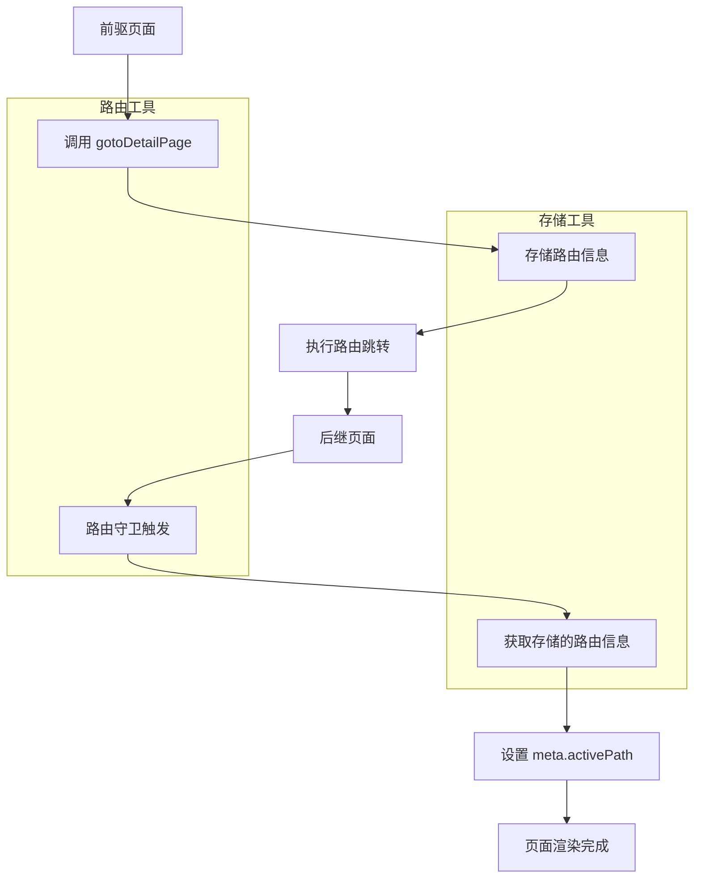

# 跳转详情页路由工具

## 📖 工具介绍

`use-goto-details-page` 是一个专门用于处理详情页跳转的组合式 API 工具。它与[详情页路由信息存储工具](../../store/modules/details-page-router-info.md)高度耦合，共同提供了完整的详情页路由管理解决方案。

### 设计思路

1. **前后页面关系管理**：维护页面跳转时的前驱页面（来源页）和后继页面（目标详情页）关系
2. **自动路由信息存储**：在跳转前自动存储路由信息，包括 `activePath`（前驱页地址）
3. **路由守卫集成**：提供路由守卫处理函数，在详情页加载时自动设置 `meta.activePath`
4. **类型安全**：完全兼容 Vue Router 的类型系统和类型化路由

## 🔧 核心功能

### 主要 API

| 函数名                        | 功能描述                      | 使用场景           |
| ----------------------------- | ----------------------------- | ------------------ |
| `useGotoDetailsPage`          | 组合式 API Hook               | 在组件中使用       |
| `gotoDetailPage`              | 跳转详情页（组合式/独立式）   | 前驱页面调用       |
| `handleDetailPageBeforeEnter` | 路由守卫处理（组合式/独立式） | 详情页路由配置使用 |

### 类型定义

```typescript
/** 跳转详情页参数类型 - 兼容 router.push 的参数类型 */
export type GotoDetailPageParams = RouteLocationRaw;

/** 路由守卫参数类型 */
export interface BeforeEnterParams {
	to: RouteLocationNormalized;
	from: RouteLocationNormalized;
	next: NavigationGuardNext;
}
```

## 📚 使用示例

### 1. 在组件中使用 - 组合式 API 方式

```vue
<script setup lang="ts">
import { useGotoDetailsPage } from "@/composables/use-goto-details-page";

const { gotoDetailPage } = useGotoDetailsPage();

// 跳转到物业管理详情页
function handleViewDetail(row: any) {
	gotoDetailPage({
		name: "operation-team-data-manage--detail-page-manage-community-[id]",
		params: { id: row.编号 },
	});
}

// 跳转到用户详情页
function handleViewUser(userId: string) {
	gotoDetailPage({
		name: "user-detail-[id]",
		params: { id: userId },
		query: { tab: "basic" },
	});
}
</script>

<template>
	<div>
		<ElButton @click="handleViewDetail(row)">查看详情</ElButton>
		<ElButton @click="handleViewUser('123')">查看用户</ElButton>
	</div>
</template>
```

### 2. 独立函数调用方式

```typescript
import { gotoDetailPage } from "@/composables/use-goto-details-page";

// 在任何地方直接调用
function navigateToDetail() {
	gotoDetailPage({
		name: "property-detail-[id]",
		params: { id: "12345" },
	});
}

// 在 Pinia store 中使用
export const usePropertyStore = defineStore("property", () => {
	function viewPropertyDetail(propertyId: string) {
		gotoDetailPage({
			name: "property-management-detail-[id]",
			params: { id: propertyId },
			query: { mode: "view" },
		});
	}

	return { viewPropertyDetail };
});
```

### 3. 详情页路由配置 - 使用路由守卫

```typescript
// 在路由配置文件中
import { handleDetailPageBeforeEnter } from "@/composables/use-goto-details-page";

// 方式 1：使用独立函数
definePage({
	meta: {
		title: "物业详情",
		icon: "f7:menu",
	},
	beforeEnter: handleDetailPageBeforeEnter,
});

// 方式 2：自定义路由守卫
definePage({
	meta: {
		title: "用户详情",
		icon: "user",
	},
	beforeEnter: (to, from, next) => {
		// 处理详情页路由信息
		handleDetailPageBeforeEnter(to, from, next);

		// 其他自定义逻辑
		console.log("进入用户详情页");

		// 继续路由流程
		return next();
	},
});

// 方式 3：在组件中使用组合式 API
export default definePageComponent({
	setup() {
		const { handleDetailPageBeforeEnter } = useGotoDetailsPage();

		// 可以在组件逻辑中调用
		// handleDetailPageBeforeEnter(to, from, next);
	},
});
```

### 4. 完整的业务流程示例

```vue
<!-- 列表页面 (前驱页) -->
<script setup lang="ts">
import { useGotoDetailsPage } from "@/composables/use-goto-details-page";

definePage({
	meta: {
		title: "物业管理列表",
		icon: "list",
	},
});

const { gotoDetailPage } = useGotoDetailsPage();

interface PropertyItem {
	编号: string;
	名称: string;
	地址: string;
}

// 跳转到管理小区页面
function gotoManageCommunityPage(row: PropertyItem) {
	gotoDetailPage({
		name: "operation-team-data-manage--detail-page-manage-community-[id]",
		params: { id: row.编号 },
	});
}
</script>

<template>
	<div>
		<PureTable>
			<template #operation="{ row }">
				<ElButton @click="gotoManageCommunityPage(row)"> 管理小区 </ElButton>
			</template>
		</PureTable>
	</div>
</template>
```

```vue
<!-- 详情页面 (后继页) -->
<script setup lang="ts">
import { handleDetailPageBeforeEnter } from "@/composables/use-goto-details-page";

// 配置路由守卫，自动设置 activePath
definePage({
	meta: {
		title: "管理小区详情",
		icon: "community",
	},
	beforeEnter: handleDetailPageBeforeEnter,
});

// 现在可以通过 route.meta.activePath 获取前驱页地址
const route = useRoute();
console.log("来源页面:", route.meta.activePath);
</script>
```

## 🚀 核心流程说明

### 前驱页跳转流程

1. **参数解析**：解析路由跳转参数，提取路由名称、参数和查询字符串
2. **路由查找**：使用 `getRouteByName` 函数获取目标路由信息
3. **设置 activePath**：直接设置目标路由的 `meta.activePath` 为前驱页地址
4. **信息存储**：使用路由名称作为 key 存储路由信息
5. **执行跳转**：调用 `router.push` 执行实际跳转

### 后继页加载流程

1. **路由守卫触发**：在详情页路由守卫中触发处理函数
2. **准备路由信息**：获取当前路由的名称
3. **信息检索**：根据路由名称从存储中获取路由信息
4. **Meta 设置**：将前驱页地址设置到 `to.meta.activePath`
5. **守卫继续**：调用 `next()` 继续路由流程

## 🔗 与存储工具的关系

该工具与[详情页路由信息存储工具](../store/modules/details-page-router-info.md)的协作关系：



## 🎯 特性优势

### 1. 类型安全

- 完全兼容 Vue Router 的类型系统
- 支持类型化路由的类型检查
- 编译时类型验证

### 2. 自动化处理

- 自动存储和恢复路由信息
- 自动设置 `meta.activePath`
- 无需手动管理页面关系

### 3. 灵活使用

- 组合式 API 和独立函数两种使用方式
- 支持在组件、Store、路由配置中使用
- 兼容现有的路由跳转方式

### 4. 错误处理

- 完善的异常处理机制
- 优雅降级，确保跳转不受影响
- 详细的警告和错误信息

## ⚠️ 注意事项

### 1. 路由名称要求

- **建议使用命名路由**：字符串路径无法获取路由信息，会降级为普通跳转
- **确保路由名称存在**：不存在的路由名称会导致信息存储失败

### 2. 路由守卫配置

- 必须在详情页配置 `beforeEnter` 路由守卫
- 路由守卫必须调用 `next()` 继续流程

### 3. 存储清理

- 路由信息会持久化存储，建议定期清理
- 可以使用存储工具的 `clearAllRouteInfo` 方法清理

## 🎯 最佳实践

### 1. 统一跳转方式

```typescript
// ✅ 推荐：使用统一的跳转函数
function handleViewDetail(id: string) {
	gotoDetailPage({
		name: "detail-page-[id]",
		params: { id },
	});
}

// ❌ 不推荐：直接使用 router.push
function handleViewDetail(id: string) {
	router.push(`/detail/${id}`);
}
```

### 2. 路由守卫配置

```typescript
// ✅ 推荐：使用提供的路由守卫函数
definePage({
	meta: { title: "详情页" },
	beforeEnter: handleDetailPageBeforeEnter,
});

// ❌ 不推荐：不配置路由守卫
definePage({
	meta: { title: "详情页" },
	// 缺少 beforeEnter 配置
});
```

### 3. 错误处理

```typescript
// ✅ 推荐：处理跳转结果
try {
	await gotoDetailPage({
		name: "detail-[id]",
		params: { id: "123" },
	});
} catch (error) {
	console.error("跳转失败:", error);
}
```

## 📝 更新日志

- **v1.0.0** - 初始版本，提供基础的详情页跳转功能
- 集成详情页路由信息存储工具
- 支持组合式 API 和独立函数两种使用方式
- 完整的 TypeScript 类型支持
