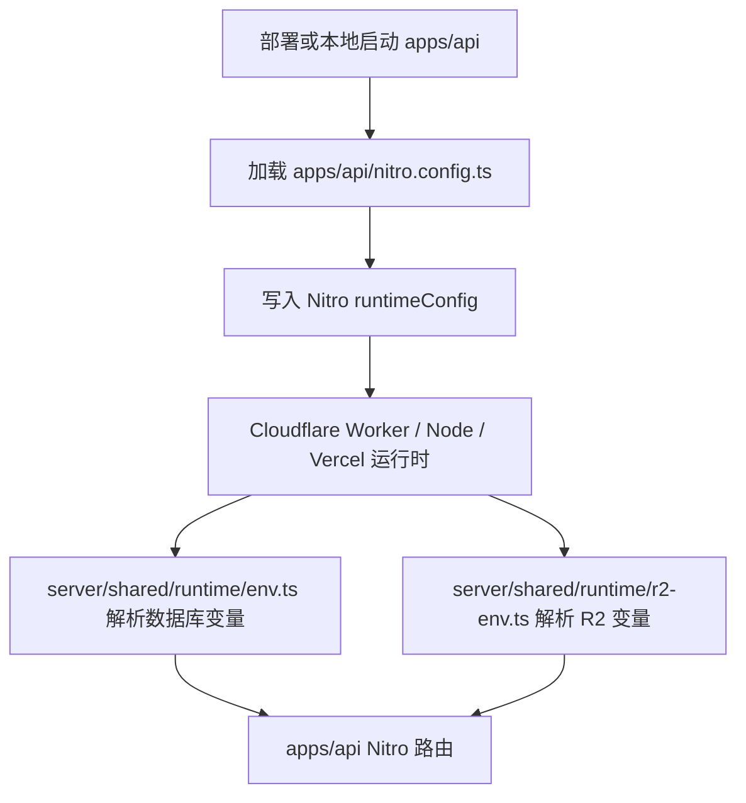

# Nitro 接口环境变量配置指南

本文档说明独立 Nitro API 服务在部署和运行时如何获取 Neon 与 R2 环境变量。当前权威入口是 `apps/api`，admin 旧 Nitro 入口仅作为 legacy source 或历史兼容参考。

## 1. 环境变量获取链路



## 2. 关键文件说明

| 文件                                          | 说明                                        |
| --------------------------------------------- | ------------------------------------------- |
| `apps/api/nitro.config.ts`                    | 独立 API 服务 Nitro 配置                    |
| `apps/api/server/shared/runtime/env.ts`       | 数据库 URL、CORS 和公共运行时配置解析       |
| `apps/api/server/shared/runtime/r2-env.ts`    | R2 必需环境变量解析和 readiness 结果        |
| `apps/api/server/db/index.ts`                 | 通过 `useDb(event)` 创建 Drizzle 数据库实例 |
| `apps/api/server/routes/__nitro/ready.get.ts` | 数据库与 R2 readiness 检查                  |

## 3. 数据库环境变量

`apps/api` 支持以下数据库 URL，按解析顺序择一使用：

```bash
comm_admin_11__DATABASE_URL="postgresql://..."
NITRO_DATABASE_URL="postgresql://..."
DATABASE_URL="postgresql://..."
POSTGRES_URL="postgresql://..."
POSTGRES_PRISMA_URL="postgresql://..."
VERCEL_POSTGRES_URL="postgresql://..."
```

`comm_admin_11__DATABASE_URL` 保留历史 Vercel Neon 前缀命名，但当前由 `apps/api` 消费。

## 4. R2 环境变量

文件上传相关能力由 `apps/api` 的 R2 runtime 模块读取以下变量：

```bash
R2_ENDPOINT="https://..."
R2_BUCKET="01s-11comm-files"
R2_ACCESS_KEY_ID="..."
R2_SECRET_ACCESS_KEY="..."
R2_PUBLIC_BASE_URL="https://..."
```

readiness 接口会在缺少任一必需 R2 变量时返回受控失败。

## 5. 本地验证方式

### 5.1 类型与基础设施测试

```bash
pnpm -F @01s-11comm/api run typecheck
pnpm -F @01s-11comm/api run test:infra
```

### 5.2 构建验证

```bash
pnpm -F @01s-11comm/api run build:cloudflare
pnpm -F @01s-11comm/api run build:node
```

### 5.3 readiness 验证

启动独立 API 服务：

```bash
pnpm -F @01s-11comm/api dev
```

访问：

```bash
curl http://127.0.0.1:3102/__nitro/ready
```

生产 API 地址以 `apps/api/package.json` 的 `homepage` 字段为准。

## 6. 常见问题

### 6.1 数据库变量未找到

**症状**：接口返回数据库 URL 未配置。

**解决方案**：

1. 确认 `apps/api` 运行环境存在至少一个数据库 URL。
2. Cloudflare Worker 部署时确认变量注入到 runtime env。
3. Node/Vercel 运行时确认变量存在于 `process.env` 或 Nitro runtimeConfig。

### 6.2 R2 readiness 失败

**症状**：`/__nitro/ready` 返回 `R2_ENV_MISSING`。

**解决方案**：

1. 补齐 `R2_ENDPOINT`、`R2_BUCKET`、`R2_ACCESS_KEY_ID`、`R2_SECRET_ACCESS_KEY`、`R2_PUBLIC_BASE_URL`。
2. 运行 `pnpm -F @01s-11comm/api run test:infra` 验证解析逻辑。

### 6.3 仍看到 admin Nitro 文档或命令

admin 旧入口只能理解为 legacy source。新接口、新迁移、新 seed、新 readiness 和 R2 运维都必须从 `apps/api` 推进。
