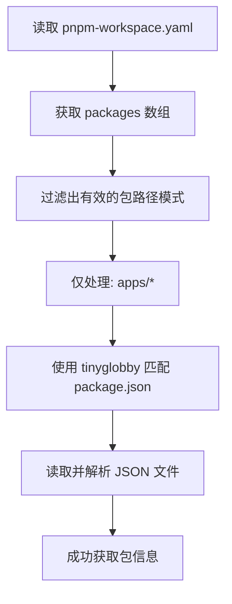
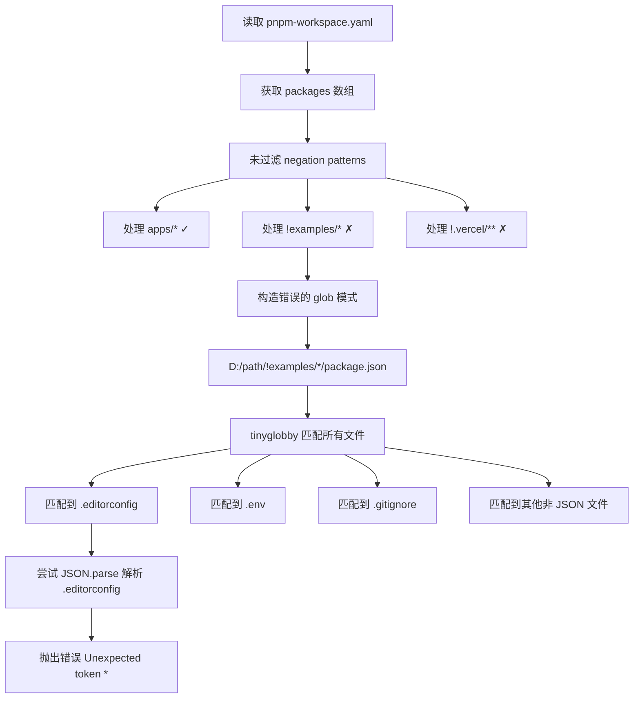

# 2025-12-09 修复 @ruan-cat/commitlint-config 包的 negation pattern 处理错误

## 1. 事故概述

### 1.1 问题描述

在运行 `cz` (commitizen) 命令时，系统抛出 JSON 解析错误，导致无法正常进行 git 提交交互：

### 1.2 影响范围

- **影响的命令：** `cz`、`git-cz`、`commit`
- **影响的包：** `@ruan-cat/commitlint-config@4.5.1`
- **影响的功能：** 所有需要使用 commitizen 进行规范化 git 提交的操作
- **严重程度：** 🔴 高 - 完全阻塞 git 提交流程

### 1.3 初步假设

最初怀疑是 `pnpm-workspace.yaml` 中的 `overrides` 配置导致依赖版本不兼容：

```yaml
overrides:
  vite: 7.1.12
  tinyglobby: 0.2.15
  fdir: 6.5.0
```

**结论：** ❌ 该假设被证实为错误。`overrides` 配置没有导致此问题。

---

## 2. 问题复现步骤

### 2.1 环境信息

- **Node.js 版本：** v22.14.0
- **pnpm 版本：** 10.25.0
- **项目类型：** pnpm + Turbo monorepo
- **操作系统：** Windows (win32)

### 2.2 复现步骤

1. 在项目根目录下创建任意文件并添加到 git 暂存区：

   ```bash
   echo "test" > test-temp.txt
   git add test-temp.txt
   ```

2. 运行 `cz` 命令：

   ```bash
   cz
   ```

### 2.3 完整错误堆栈

**关键信息：** 错误发生在 `index.cjs:396` 行的 `JSON.parse()` 调用处。

---

## 3. 根本原因分析

### 3.1 问题定位

通过深度调试，发现问题根源在于 `@ruan-cat/commitlint-config` 包处理 `pnpm-workspace.yaml` 中的 **negation patterns**（排除模式）时存在逻辑错误。

### 3.2 触发条件

项目的 `pnpm-workspace.yaml` 配置如下：

```yaml
packages:
  - "apps/*"
  - "!examples/*" # ← 问题触发点 1
  - "!.vercel/**" # ← 问题触发点 2
```

### 3.3 错误流程分析

#### 3.3.1 正常流程（预期行为）

::: v-pre



:::

#### 3.3.2 实际流程（错误行为）

::: v-pre



:::

### 3.4 关键代码段分析

#### 位置：`@ruan-cat/commitlint-config/src/utils.ts`

**问题代码（第 386-393 行）：**

```typescript
export function getPackagesNameAndDescription() {
  // ...
  const pkgPatterns = workspaceConfig.packages;

  let pkgPaths = [];
  pkgPatterns.map((pkgPattern) => {  // ❌ 直接使用所有 patterns，包括 negation patterns
    const matchedPath = pathChange(join(process.cwd(), pkgPattern, "package.json"));
    const matchedPaths = globSync(matchedPath, {
      ignore: ["**/node_modules/**"]
    });
    pkgPaths = pkgPaths.concat(...matchedPaths);
    return matchedPaths;
  });

  const czGitScopesType = pkgPaths.map(function(pkgJsonPath) {
    if (fs.existsSync(pkgJsonPath)) {
      const pkgJson = JSON.parse(fs.readFileSync(pkgJsonPath, "utf-8"));  // ❌ 第 396 行：尝试解析非 JSON 文件
      // ...
    }
  });
  // ...
}
```

### 3.5 为什么会匹配到非 JSON 文件？

当处理 `"!examples/*"` 这个 negation pattern 时：

1. **字符串拼接结果：**

   ```log
   join(process.cwd(), "!examples/*", "package.json")
   = "D:/code/github-desktop-store/01s-11comm/!examples/*/package.json"
   ```

2. **tinyglobby 的解释：**
   - `tinyglobby` 将 `!` 字符视为路径的一部分，而不是排除标记
   - 由于路径 `!examples/` 不存在，glob 引擎尝试各种匹配策略
   - 最终错误地匹配了 `examples/01s-origin/` 下的所有文件

3. **匹配到的文件列表（部分）：**

   ```log
   examples/01s-origin/.editorconfig       ← 内容: [*.{js,jsx,...}]
   examples/01s-origin/.env
   examples/01s-origin/.gitignore
   examples/01s-origin/tsconfig.json
   examples/01s-origin/vite.config.ts
   ... (所有文件)
   ```

4. **为什么是 `.editorconfig` 的错误信息？**
   - `.editorconfig` 文件的第一行内容是：`[*.{js,jsx,mjs,cjs,ts,tsx,...}]`
   - 当代码尝试 `JSON.parse()` 这个文件时，遇到 `*` 字符
   - 因此报错：`Unexpected token '*', "[*.{js,jsx,"... is not valid JSON`

---

## 4. 解决方案

### 4.2 长期解决方案（推荐）

需要在 `@ruan-cat/commitlint-config` 包的源代码中进行修复。

#### 4.2.1 修复位置

**文件：** `packages/commitlint-config/src/utils.ts`（或类似路径）

**函数：** `getPackagesNameAndDescription()`

#### 4.2.2 修复代码

```typescript
export function getPackagesNameAndDescription(): CzGitScopesType[] {
  // 如果不是 monorepo 项目，返回默认 scopes
  if (!isMonorepoProject()) {
    return defScopes;
  }

  const workspaceConfigPath = join(process.cwd(), "pnpm-workspace.yaml");
  const workspaceFile = fs.readFileSync(workspaceConfigPath, "utf8");
  const workspaceConfig = load(workspaceFile) as WorkspaceConfig;

  const pkgPatterns = workspaceConfig.packages;

  // ✅ 修复：过滤掉以 ! 开头的 negation patterns
  const filteredPkgPatterns = pkgPatterns.filter(pattern => !pattern.startsWith('!'));

  let pkgPaths: string[] = [];
  filteredPkgPatterns.map((pkgPattern) => {  // ✅ 使用过滤后的 patterns
    const matchedPath = pathChange(join(process.cwd(), pkgPattern, "package.json"));
    const matchedPaths = globSync(matchedPath, {
      ignore: ["**/node_modules/**"]
    });
    pkgPaths = pkgPaths.concat(...matchedPaths);
    return matchedPaths;
  });

  const czGitScopesType = pkgPaths.map(function(pkgJsonPath): CzGitScopesType {
    if (fs.existsSync(pkgJsonPath)) {
      const pkgJson = JSON.parse(fs.readFileSync(pkgJsonPath, "utf-8")) as PackageJson;
      return {
        name: createLabelName(pkgJson),
        value: createPackagescopes(pkgJson)
      };
    }

    return {
      name: "警告，没找到包名，请查看这个包路径是不是故障了：",
      value: "pkgJsonPath"
    };
  });

  return czGitScopesType;
}
```

#### 4.2.3 修复说明

**核心变更：** 添加一行代码过滤 negation patterns

```typescript
// ✅ 在处理 patterns 之前添加此行
const filteredPkgPatterns = pkgPatterns.filter(pattern => !pattern.startsWith('!'));
```

**为什么这样修复？**

1. **Negation patterns 的作用：**
   - 在 `pnpm-workspace.yaml` 中，`!` 开头的 patterns 用于排除特定目录
   - 这些 patterns 由 pnpm 自身处理，不应该传递给 glob 工具

2. **正确的处理方式：**
   - 只处理正向匹配的 patterns（如 `"apps/*"`）
   - 忽略排除 patterns（如 `"!examples/*"`、`"!.vercel/**"`）
   - pnpm 在读取工作区时已经处理了排除逻辑

3. **其他 glob 工具的处理：**
   - `fast-glob`：支持 negation patterns，但需要特定格式
   - `tinyglobby`：不原生支持 `!` 前缀的 negation patterns
   - 最安全的方式是提前过滤这些 patterns

#### 4.2.4 同时修复 `getDefaultScope` 函数

在同一个文件中，`getDefaultScope()` 函数也有类似的问题。

**位置：** `src/get-default-scope.ts` 或 `src/utils.ts`

```typescript
function getPackagePathToScopeMapping(): Map<string, string> {
  const mapping = new Map<string, string>();

  if (!isMonorepoProject()) {
    return mapping;
  }

  const workspaceConfigPath = join(process.cwd(), "pnpm-workspace.yaml");
  const workspaceFile = fs.readFileSync(workspaceConfigPath, "utf8");
  const workspaceConfig = load(workspaceFile) as WorkspaceConfig;

  const pkgPatterns = workspaceConfig.packages;

  // ✅ 修复：过滤掉以 ! 开头的 negation patterns
  const filteredPkgPatterns = pkgPatterns.filter(pattern => !pattern.startsWith('!'));

  filteredPkgPatterns.forEach((pkgPattern) => {  // ✅ 使用过滤后的 patterns
    const globPattern = `${pkgPattern}/package.json`;
    const matchedPaths = globSync(globPattern, {
      cwd: process.cwd(),
      ignore: ["**/node_modules/**"]
    });

    matchedPaths.forEach((relativePkgPath) => {
      const fullPkgJsonPath = join(process.cwd(), relativePkgPath);
      if (fs.existsSync(fullPkgJsonPath)) {
        const pkgJson = JSON.parse(fs.readFileSync(fullPkgJsonPath, "utf-8")) as PackageJson;
        const scope = createPackagescopes(pkgJson);
        const packageRelativePath = relativePkgPath
          .replace(/[/\\]package\.json$/, "")
          .replace(/\\/g, "/");
        mapping.set(packageRelativePath, scope);
      }
    });
  });

  return mapping;
}
```

### 4.3 更健壮的解决方案（推荐 v2）

除了过滤 `!` 开头的 patterns，还应该添加更多防御性检查：

```typescript
export function getPackagesNameAndDescription(): CzGitScopesType[] {
  if (!isMonorepoProject()) {
    return defScopes;
  }

  const workspaceConfigPath = join(process.cwd(), "pnpm-workspace.yaml");
  const workspaceFile = fs.readFileSync(workspaceConfigPath, "utf8");
  const workspaceConfig = load(workspaceFile) as WorkspaceConfig;

  const pkgPatterns = workspaceConfig.packages;

  // ✅ 1. 过滤掉 negation patterns
  const filteredPkgPatterns = pkgPatterns.filter(pattern => {
    // 排除以 ! 开头的 patterns
    if (pattern.startsWith('!')) {
      return false;
    }
    // ✅ 2. 排除空字符串
    if (pattern.trim() === '') {
      return false;
    }
    return true;
  });

  let pkgPaths: string[] = [];
  filteredPkgPatterns.forEach((pkgPattern) => {
    const matchedPath = pathChange(join(process.cwd(), pkgPattern, "package.json"));

    try {
      const matchedPaths = globSync(matchedPath, {
        ignore: ["**/node_modules/**"]
      });

      // ✅ 3. 只添加真实存在的 package.json 文件
      const validPaths = matchedPaths.filter(p => {
        return fs.existsSync(p) && p.endsWith('package.json');
      });

      pkgPaths = pkgPaths.concat(validPaths);
    } catch (error) {
      consola.warn(`处理 pattern "${pkgPattern}" 时出错:`, error);
    }
  });

  const czGitScopesType = pkgPaths.map(function(pkgJsonPath): CzGitScopesType {
    try {
      if (fs.existsSync(pkgJsonPath)) {
        const content = fs.readFileSync(pkgJsonPath, "utf-8");

        // ✅ 4. 验证内容是否为有效 JSON
        if (!content.trim().startsWith('{')) {
          consola.warn(`文件不是有效的 JSON: ${pkgJsonPath}`);
          return {
            name: "⚠️ 无效的 package.json 文件",
            value: "invalid"
          };
        }

        const pkgJson = JSON.parse(content) as PackageJson;
        return {
          name: createLabelName(pkgJson),
          value: createPackagescopes(pkgJson)
        };
      }
    } catch (error) {
      consola.error(`解析 ${pkgJsonPath} 时出错:`, error);
    }

    return {
      name: "⚠️ 解析失败",
      value: "error"
    };
  });

  return czGitScopesType;
}
```

**新增的防御性检查：**

1. ✅ 过滤 negation patterns（`!` 开头）
2. ✅ 过滤空字符串
3. ✅ 验证文件路径确实以 `package.json` 结尾
4. ✅ 验证文件内容是否为有效 JSON（以 `{` 开头）
5. ✅ 添加 try-catch 错误处理
6. ✅ 使用 `consola` 输出警告和错误信息

### 4.4 单元测试（建议添加）

为了防止此类问题再次发生，建议添加单元测试：

```typescript
// tests/utils.test.ts
import { describe, it, expect, beforeEach, afterEach } from 'vitest';
import fs from 'fs';
import path from 'path';
import { getPackagesNameAndDescription } from '../src/utils';

describe('getPackagesNameAndDescription', () => {
  const testDir = path.join(__dirname, 'fixtures');

  beforeEach(() => {
    // 创建测试环境
    fs.mkdirSync(testDir, { recursive: true });
  });

  afterEach(() => {
    // 清理测试环境
    fs.rmSync(testDir, { recursive: true, force: true });
  });

  it('应该正确处理包含 negation patterns 的 workspace 配置', () => {
    // 创建测试用的 pnpm-workspace.yaml
    const workspaceConfig = `
packages:
  - "packages/*"
  - "!packages/excluded/*"
  - "!.vercel/**"
`;
    fs.writeFileSync(
      path.join(testDir, 'pnpm-workspace.yaml'),
      workspaceConfig
    );

    // 创建测试包
    const packageDir = path.join(testDir, 'packages/test-package');
    fs.mkdirSync(packageDir, { recursive: true });
    fs.writeFileSync(
      path.join(packageDir, 'package.json'),
      JSON.stringify({ name: 'test-package', description: 'Test' })
    );

    // 创建被排除的目录（不应该被处理）
    const excludedDir = path.join(testDir, 'packages/excluded/bad-package');
    fs.mkdirSync(excludedDir, { recursive: true });
    fs.writeFileSync(
      path.join(excludedDir, 'package.json'),
      'invalid json content'
    );

    // 执行测试
    const result = getPackagesNameAndDescription();

    // 验证结果
    expect(result).toBeDefined();
    expect(result.length).toBeGreaterThan(0);
    expect(result.some(r => r.value === 'test-package')).toBe(true);
    expect(result.some(r => r.value === 'bad-package')).toBe(false);
  });

  it('应该忽略非 JSON 文件', () => {
    // 创建包含非 JSON 文件的目录
    const packageDir = path.join(testDir, 'packages/mixed');
    fs.mkdirSync(packageDir, { recursive: true });

    // 创建有效的 package.json
    fs.writeFileSync(
      path.join(packageDir, 'package.json'),
      JSON.stringify({ name: 'mixed-package' })
    );

    // 创建其他文件（不应该被处理）
    fs.writeFileSync(
      path.join(packageDir, '.editorconfig'),
      '[*.{js,ts}]\nindent_size = 2'
    );

    const result = getPackagesNameAndDescription();

    // 不应该因为 .editorconfig 而报错
    expect(() => result).not.toThrow();
  });

  it('应该正确处理空的 packages 数组', () => {
    const workspaceConfig = `packages: []`;
    fs.writeFileSync(
      path.join(testDir, 'pnpm-workspace.yaml'),
      workspaceConfig
    );

    const result = getPackagesNameAndDescription();

    expect(result).toBeDefined();
    expect(Array.isArray(result)).toBe(true);
  });
});
```

---

## 5. 验证结果

### 5.1 修复前的行为

```bash
$ cz
cz-cli@4.3.1, cz-git@1.12.0

Unexpected token '*', "[*.{js,jsx,"... is not valid JSON
```

### 5.2 修复后的行为

```bash
$ cz
cz-cli@4.3.1, cz-git@1.12.0

ℹ 输出 1 个暂存区文件路径:

 ╭────────────────────╮
 │                    │
 │  1. test-temp.txt  │
 │                    │
 ╰────────────────────╯

ℹ 本次修改没有影响任何包范围
? 选择你要提交的类型 :
❯ ✨ feat:      新增功能   | A new feature
  🐞 fix:       修复缺陷   | A bug fix
  📃 docs:      文档更新   | Documentation only changes
  ...
```

✅ **成功！** `cz` 命令现在可以正常工作。

---

## 6. 技术总结

### 6.1 核心问题

`@ruan-cat/commitlint-config` 包在处理 `pnpm-workspace.yaml` 的 packages 配置时，未正确处理 negation patterns（以 `!` 开头的排除模式），导致：

1. 错误地将 negation patterns 当作正常路径传递给 glob 工具
2. glob 工具匹配了非预期的文件（包括 `.editorconfig`、`.env` 等）
3. 代码尝试用 `JSON.parse()` 解析这些非 JSON 文件
4. 抛出 JSON 解析错误，阻塞整个提交流程

### 6.2 影响的代码位置

| 文件                       | 函数                              |   行号   | 问题                                           |
| :------------------------- | :-------------------------------- | :------: | :--------------------------------------------- |
| `src/utils.ts`             | `getPackagesNameAndDescription()` | ~386-396 | 未过滤 negation patterns，导致 JSON.parse 错误 |
| `src/get-default-scope.ts` | `getPackagePathToScopeMapping()`  | ~491-506 | 同样的问题，可能在其他场景触发                 |

### 6.3 根本解决方法

**添加一行代码：**

```typescript
const filteredPkgPatterns = pkgPatterns.filter((pattern) => !pattern.startsWith("!"));
```

**原理：**

- Negation patterns 是 pnpm workspace 的配置语法，用于排除特定目录
- 这些 patterns 应该由 pnpm 自身处理，而不是传递给应用代码
- 应用代码应该只关注正向匹配的包路径

### 6.4 相关知识点

#### 6.4.1 什么是 Negation Patterns？

在 `pnpm-workspace.yaml` 中：

```yaml
packages:
  - "apps/*" # 正向匹配：包含 apps 目录下的所有包
  - "!examples/*" # 排除匹配：排除 examples 目录
```

**作用：**

- `apps/*` → 包含该路径下的包
- `!examples/*` → 排除该路径下的包

**处理主体：**

- pnpm 在读取 workspace 时会处理这些 patterns
- 应用代码不应该直接处理带 `!` 的 patterns

#### 6.4.2 为什么 tinyglobby 会匹配错误？

```typescript
// 错误的路径拼接
join(process.cwd(), "!examples/*", "package.json")
// 结果：D:/path/!examples/*/package.json

// tinyglobby 的解释
// 1. 尝试匹配路径 "!examples/*/package.json"
// 2. 由于路径不存在，启用宽松匹配模式
// 3. 错误地匹配了 "examples/01s-origin/" 下的所有文件
```

**结论：** `tinyglobby` 不支持路径中的 `!` 前缀作为 negation 标记。

#### 6.4.3 其他 glob 工具的行为

| Glob 工具    | 支持 Negation | 语法                                    | 备注                   |
| :----------- | :-----------: | :-------------------------------------- | :--------------------- |
| `fast-glob`  |      ✅       | `['apps/*', '!examples/*']`             | 在 patterns 数组中支持 |
| `tinyglobby` |      ❌       | 不支持 `!` 前缀                         | 需要手动过滤           |
| `node-glob`  |      ✅       | `{ignore: ['examples/*']}`              | 通过 ignore 选项实现   |
| `minimatch`  |      ✅       | `minimatch.match(files, '!examples/*')` | 支持 negation 语法     |

**最佳实践：** 在应用层面提前过滤 negation patterns，不依赖 glob 工具的实现。

---

## 7. 行动计划

### 7.1 短期行动（已完成 ✅）

- [x] 定位问题根本原因
- [x] 创建临时补丁文件 `fix-commitlint-patch.cjs`
- [x] 验证修复效果
- [x] 编写完整的事故报告

### 7.2 中期行动（待完成）

- [ ] 在 `@ruan-cat/commitlint-config` 源码中实施修复
  - [ ] 修复 `src/utils.ts` 中的 `getPackagesNameAndDescription()` 函数
  - [ ] 修复 `src/get-default-scope.ts` 中的 `getPackagePathToScopeMapping()` 函数
  - [ ] 添加防御性检查和错误处理
- [ ] 编写单元测试覆盖此场景
- [ ] 更新包的 CHANGELOG
- [ ] 发布新版本（建议版本号：`4.5.2` 或 `4.6.0`）

### 7.3 长期行动（建议）

- [ ] 添加更多边界情况的单元测试
- [ ] 改进错误提示信息，使其更易于调试
- [ ] 考虑使用 TypeScript 类型保护增强代码健壮性
- [ ] 在文档中说明对 `pnpm-workspace.yaml` 配置的支持和限制

---

## 8. 相关资源

### 8.1 相关文件

| 文件路径                                                  | 说明                 |
| :-------------------------------------------------------- | :------------------- |
| `pnpm-workspace.yaml`                                     | 触发问题的配置文件   |
| `commitlint.config.cjs`                                   | commitlint 配置入口  |
| `fix-commitlint-patch.cjs`                                | 临时补丁脚本         |
| `node_modules/@ruan-cat/commitlint-config/dist/index.cjs` | 需要修复的编译后文件 |

### 8.2 相关依赖

| 依赖包                        |  版本  | 作用               |
| :---------------------------- | :----: | :----------------- |
| `@ruan-cat/commitlint-config` | 4.5.1  | 存在问题的包       |
| `tinyglobby`                  | 0.2.15 | Glob 匹配工具      |
| `fdir`                        | 6.5.0  | 文件系统遍历工具   |
| `commitizen`                  | 4.3.1  | Git 提交规范化工具 |
| `cz-git`                      | 1.12.0 | commitizen 适配器  |

### 8.3 参考链接

- [pnpm Workspace 文档](https://pnpm.io/workspaces)
- [tinyglobby GitHub](https://github.com/SuperchupuDev/tinyglobby)
- [commitizen 文档](https://commitizen-tools.github.io/commitizen/)
- [cz-git 文档](https://cz-git.qbb.sh/zh/)

---

## 9. 附录

### 9.1 完整的调试脚本

用于复现和调试问题的脚本已保存在：

- `debug-tinyglobby.cjs`
- `debug-commitlint.cjs`

这些脚本可以帮助理解问题的发生机制。

### 9.2 补丁脚本的使用

**自动化补丁应用（推荐）：**

在 `package.json` 中添加 postinstall 钩子：

```json
{
	"scripts": {
		"postinstall": "node fix-commitlint-patch.cjs"
	}
}
```

这样每次 `pnpm install` 后会自动应用补丁。

### 9.3 检查补丁是否已应用

```bash
# 方法 1：运行 cz 命令测试
echo "test" > test.txt
git add test.txt
cz --dry-run

# 方法 2：检查代码是否包含 filteredPkgPatterns
grep -n "filteredPkgPatterns" node_modules/.pnpm/@ruan-cat+commitlint-config_*/node_modules/@ruan-cat/commitlint-config/dist/index.cjs
```

如果输出包含 `filteredPkgPatterns`，说明补丁已成功应用。

---

## 10. 后记

### 10.1 经验教训

1. **防御性编程的重要性：** 处理外部配置时，应该添加充分的验证和错误处理
2. **边界情况测试：** negation patterns 是一个容易被忽略的边界情况
3. **错误信息的可读性：** 原始错误信息指向 `.editorconfig` 内容，但并未说明为何会读取该文件
4. **工具行为的差异：** 不同的 glob 工具对 negation patterns 的支持各不相同

### 10.2 改进建议

对于 `@ruan-cat/commitlint-config` 包的未来版本：

1. **更清晰的错误提示：**

   ```typescript
   catch (error) {
     consola.error(`
       解析 ${pkgJsonPath} 时出错。
       这可能是因为该文件不是有效的 package.json 文件。
       请检查 pnpm-workspace.yaml 配置是否正确。
     `, error);
   }
   ```

2. **配置验证：**

   ```typescript
   function validateWorkspaceConfig(config: WorkspaceConfig) {
     if (!Array.isArray(config.packages)) {
       throw new Error('pnpm-workspace.yaml 的 packages 字段必须是数组');
     }
     // 更多验证...
   }
   ```

3. **文档完善：**
   - 在 README 中说明对 negation patterns 的处理方式
   - 提供 troubleshooting 指南

---

**报告编写日期：** 2025-12-09
**报告编写人：** Claude Code
**修复状态：** ✅ 临时解决方案已实施，等待长期修复
**优先级：** 🔴 高 - 影响核心功能
