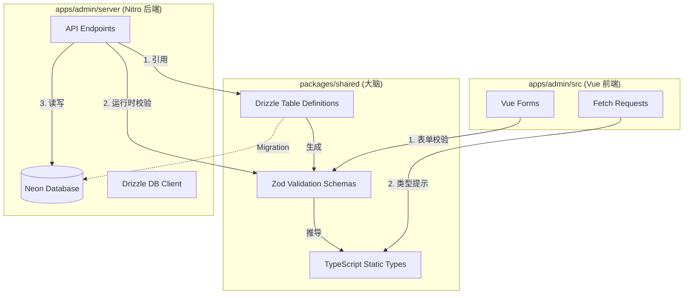

# 2026-02-05 11comm 终极全栈类型统一改造计划

这是一个非常激动人心的时刻。我们要将 `11comm` 从一个分离的前后端项目，改造成一个**真正的、类型流动的、单一事实来源（Single Source of Truth）的全栈 Monorepo**。

这不仅仅是代码的移动，这是架构哲学的升级。我们将采用 **"Schema-First"（模式优先）** 的开发策略。

以下是为你量身定制的 **《11comm 终极全栈类型统一改造计划》**。

---

### 🗺️ 宏观架构图：类型流动的血管

在新的架构中，`packages/shared` 将成为项目的大脑。



---

### 🚀 第一阶段：重铸核心 —— 改造 Shared 包

我们将废弃旧的 `apps/type` 模式（手动写接口），将其升级为由 Drizzle 和 Zod 驱动的自动化类型工厂。

#### 1.1 结构重组

建议将 `apps/type` 移动到 `packages/shared`（符合 Monorepo 标准），或者直接原地升级 `apps/type`。

**新的目录结构：**

```text
packages/shared/
├── package.json
├── tsconfig.json
├── src/
│   ├── index.ts          # 统一导出入口
│   ├── db/               # 数据库定义 (原 apps/admin/server/db/schemas)
│   │   ├── users.ts
│   │   ├── communities.ts
│   │   └── ...
│   └── common/           # 纯前端或非数据库的通用类型

```

#### 1.2 安装核心军火库

在 `packages/shared` 中安装：

```bash
pnpm add drizzle-orm zod drizzle-zod
pnpm add -D typescript

```

#### 1.3 编写“全能 Schema” (核心代码)

这是整个计划中最关键的一步。以前你只写 SQL 定义，现在你要让它同时产出 SQL、校验规则和 TS 类型。

以 `packages/shared/src/db/community.ts` 为例：

```typescript
import { pgTable, serial, text, timestamp, boolean } from "drizzle-orm/pg-core";
import { createInsertSchema, createSelectSchema } from "drizzle-zod";
import { z } from "zod";

// ==========================================
// 1. Drizzle Table (数据库层)
// ==========================================
export const community = pgTable("community", {
	id: serial("id").primaryKey(),
	name: text("name").notNull(), // 数据库层面非空
	address: text("address"),
	contactPhone: text("contact_phone"),
	createdAt: timestamp("created_at").defaultNow(),
});

// ==========================================
// 2. Zod Schemas (验证层 - 运行时)
// ==========================================

// 用于【创建】时的验证：自动去除 id, createdAt 等由数据库生成的字段
export const insertCommunitySchema = createInsertSchema(community, {
	// 可以在这里扩展更细致的校验逻辑，覆盖默认推导
	name: (schema) => schema.min(2, "小区名称至少需要2个字符").max(50, "名称太长"),
	contactPhone: (schema) => schema.regex(/^1[3-9]\d{9}$/, "手机号格式不正确").optional(),
});

// 用于【更新】时的验证：通常 ID 是必须的，其他部分可选
export const updateCommunitySchema = insertCommunitySchema.partial().extend({
	id: z.number(),
});

// 用于【查询/返回】时的验证：包含所有字段
export const selectCommunitySchema = createSelectSchema(community);

// ==========================================
// 3. TypeScript Types (静态类型层 - 编译时)
// ==========================================
export type Community = z.infer<typeof selectCommunitySchema>; // 完整的数据库对象
export type NewCommunity = z.infer<typeof insertCommunitySchema>; // 创建时的参数对象
export type UpdateCommunity = z.infer<typeof updateCommunitySchema>; // 更新时的参数对象
```

---

### 🛠️ 第二阶段：后端革命 —— Nitro 的类型安全

现在，后端不再需要手动检查 `req.body.name` 是否存在，也不需要手动把数据库对象转成 Interface。

#### 2.1 配置 Drizzle

修改 `apps/admin/server/db/index.ts`（数据库连接文件），让它从 shared 包引入 Schema。

```typescript
import { drizzle } from "drizzle-orm/neon-http";
import { neon } from "@neondatabase/serverless";
import * as schema from "@11comm/shared"; // <--- 引用 Shared 包

const sql = neon(process.env.DATABASE_URL!);
export const db = drizzle(sql, { schema });
```

#### 2.2 编写“防弹”接口

在 Nitro 接口中，使用 `readValidatedBody` 配合 Zod。

**文件**: `apps/admin/server/api/community/create.post.ts`

```typescript
import { insertCommunitySchema } from "@11comm/shared";
import { db } from "~/server/db";
import { community } from "@11comm/shared";

export default defineEventHandler(async (event) => {
	// 🛡️ 第一道防线：Zod 自动校验
	// 如果前端传的数据不对（比如名字太短），这里直接抛出 400 错误
	// body 的类型在 TS 中自动变为 NewCommunity 类型
	const body = await readValidatedBody(event, insertCommunitySchema.parse);

	// 💾 第二道防线：类型安全的数据库操作
	// Drizzle 知道 community 表需要什么字段，body 类型完全匹配
	const result = await db.insert(community).values(body).returning();

	return { success: true, data: result[0] };
});
```

---

### 🎨 第三阶段：前端升级 —— Vue 与 Zod 的共舞

前端不再需要猜测后端的字段，也不需要手动写表单验证规则。

#### 3.1 表单校验复用

使用 `vee-validate` 或直接使用 Zod 进行校验。这里展示最原生的用法。

**文件**: `apps/admin/src/views/community/form.vue`

```vue
<script setup lang="ts">
import { ref } from "vue";
import { insertCommunitySchema, type NewCommunity } from "@11comm/shared";

// 1. 类型提示：IDE 会提示 name, address, contactPhone
const formData = ref<NewCommunity>({
	name: "",
	address: "",
	contactPhone: "",
});

const errors = ref<Record<string, string>>({});

const handleSubmit = async () => {
	// 2. 校验逻辑：直接复用后端规则！
	// 无论是必填校验，还是 min(2) 长度校验，甚至正则，全部生效
	const result = insertCommunitySchema.safeParse(formData.value);

	if (!result.success) {
		// 处理错误信息
		const formatted = result.error.format();
		console.error("校验失败", formatted);
		alert(formatted.name?._errors[0] || "表单有误");
		return;
	}

	// 3. 安全发送
	// 此时 result.data 是经过清洗的、绝对安全的数据
	await $fetch("/api/community/create", {
		method: "POST",
		body: result.data,
	});
};
</script>
```

---

### ⚔️ 第四阶段：工程化与维护 (DevOps)

让这一套体系运转起来，还需要一点配置魔法。

#### 4.1 统一迁移配置 (`drizzle.config.ts`)

你需要告诉 Drizzle Kit，你的 Schema 在 Shared 包里。

**文件**: `apps/admin/drizzle.config.ts`

```typescript
import { defineConfig } from "drizzle-kit";

export default defineConfig({
	// 指向 shared 包里的源码文件，而不是编译后的文件
	schema: "../../packages/shared/src/db/*.ts",
	out: "./drizzle",
	dialect: "postgresql",
	dbCredentials: {
		url: process.env.DATABASE_URL!,
	},
});
```

#### 4.2 解决前端 Vite 引用问题

`drizzle-orm` 的某些部分是给 Node.js 用的。在前端 Vue (Vite) 中引用 Shared 包时，要确保你的 `packages/shared/package.json` 配置了正确的导出，或者在 Vite 配置中处理。

通常，只要 Shared 包只导出纯 Schema 定义（`pgTable`），不导出 `db` 实例（包含连接池），Vite 是可以完美处理的。

**关键原则：**

- `packages/shared`: 只放定义 (Definition)、类型 (Types)、纯函数 (Utils)。**绝对不要放 `drizzle(...)` 的连接代码。**
- `apps/admin/server`: 放数据库连接代码 (Connection)。

---

### 🌟 最终成果清单

完成这个计划后，你的项目将拥有：

1. **修改一处，处处生效**：在 `shared` 修改了字段名 `phone` -> `mobile`，后端 API 报错，前端 API 调用报错，前端表单组件报错。**重构不再是噩梦。**
2. **零冗余代码**：不需要再写一遍 `interface UserRequest`，也不需要再写一遍 `rules: { name: [required: true] }`。
3. **极致的安全性**：不仅仅是 TS 类型安全，还有 Zod 带来的运行时数据结构安全。
4. **野心勃勃的基础**：这套架构完全兼容未来引入 `tRPC`。如果你以后想用 tRPC，只需要在后端加一个 Router，直接引用这些现成的 Zod Schema 即可。

### 📅 行动建议

1. **今天**：在根目录创建 `packages/shared`，初始化 `package.json`。
2. **明天**：挑选一个最简单的表（比如 `Dictionary` 字典表），按上述步骤将其迁移到 Shared 包，并在 Nitro 和 Vue 中跑通流程。
3. **后天**：一旦跑通，就可以开始批量迁移其他 Schema。

准备好开始动手了吗？这绝对是值得投入的工程化改造！
