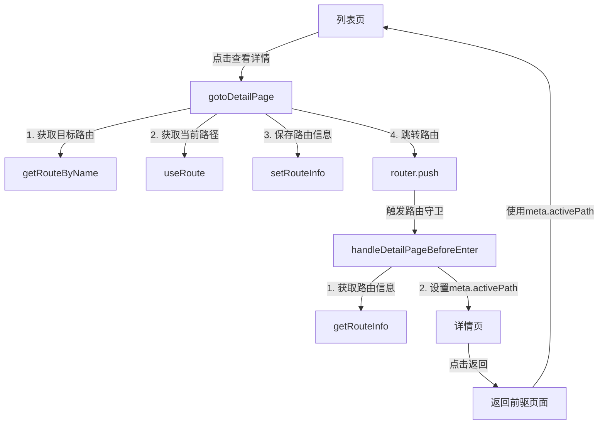

# 跳转详情页路由工具

## 简介

`use-goto-detail-page` 是一个用于处理详情页跳转的组合式 API 工具，它与「基于路由名称的键值对存储工具」高度耦合，提供了一种便捷的方式来处理前驱页面和后继页面之间的关系，特别适用于列表页到详情页的跳转场景。

## 核心功能

1. **前后页面关系管理**：自动处理前驱页面（如列表页）和后继页面（如详情页）之间的关系
2. **自动路由信息存储**：在跳转前自动存储前驱页面的路径信息
3. **路由守卫集成**：提供路由守卫处理函数，自动设置后继页面的 meta.activePath
4. **类型安全**：完全支持 Vue Router 的类型系统，确保类型安全

## 主要 API

### useGotoDetailPage

组合式 API 函数，返回跳转详情页相关的工具函数。

```typescript
function useGotoDetailPage(): {
  gotoDetailPage: (to: RouteLocationRaw) => Promise<void | NavigationFailure | undefined>;
  handleDetailPageBeforeEnter: (to: RouteLocationNormalized, from: RouteLocationNormalized, next: NavigationGuardNext) => void;
}
```

### gotoDetailPage

跳转到详情页的函数，支持与 `router.push` 相同的参数格式。

```typescript
function gotoDetailPage(to: RouteLocationRaw): Promise<void | NavigationFailure | undefined>
```

参数：
- `to`: 路由位置，与 router.push 参数相同，可以是字符串路径或包含 name/path 的对象

返回值：
- 返回 Promise，与 router.push 返回值相同

示例：

```typescript
// 在组件中使用组合式 API
import { useGotoDetailPage } from '@/hooks/use-goto-detail-page';

const { gotoDetailPage } = useGotoDetailPage();

// 使用路由名称跳转
gotoDetailPage({ name: 'user-detail', params: { id: 123 } });

// 使用路径跳转
gotoDetailPage('/user/detail/123');
```

```typescript
// 直接使用独立函数
import { gotoDetailPage } from '@/hooks/use-goto-detail-page';

// 使用路由名称跳转
gotoDetailPage({ name: 'user-detail', params: { id: 123 } });
```

### handleDetailPageBeforeEnter

详情页路由守卫处理函数，用于在详情页的 beforeEnter 守卫中设置 meta.activePath。

```typescript
function handleDetailPageBeforeEnter(
  to: RouteLocationNormalized,
  from: RouteLocationNormalized,
  next: NavigationGuardNext
): void
```

参数：
- `to`: 目标路由对象
- `from`: 来源路由对象
- `next`: 路由守卫 next 函数

示例：

```typescript
// 在路由配置中使用
import { handleDetailPageBeforeEnter } from '@/hooks/use-goto-detail-page';

const routes = [
  {
    path: '/user/detail/:id',
    name: 'user-detail',
    component: () => import('@/pages/user/detail.vue'),
    beforeEnter: (to, from, next) => {
      handleDetailPageBeforeEnter(to, from, next);
      next();
    }
  }
];
```

## 详情页路由配置

在详情页的路由配置中，有三种方式使用路由守卫：

### 1. 使用独立函数

```typescript
import { handleDetailPageBeforeEnter } from '@/hooks/use-goto-detail-page';

const routes = [
  {
    path: '/user/detail/:id',
    name: 'user-detail',
    component: () => import('@/pages/user/detail.vue'),
    beforeEnter: (to, from, next) => {
      handleDetailPageBeforeEnter(to, from, next);
      next();
    }
  }
];
```

### 2. 自定义路由守卫

```typescript
import { handleDetailPageBeforeEnter } from '@/hooks/use-goto-detail-page';

// 自定义路由守卫
function customBeforeEnter(to, from, next) {
  // 处理详情页路由守卫
  handleDetailPageBeforeEnter(to, from, next);
  
  // 其他自定义逻辑
  console.log('进入详情页');
  
  next();
}

const routes = [
  {
    path: '/user/detail/:id',
    name: 'user-detail',
    component: () => import('@/pages/user/detail.vue'),
    beforeEnter: customBeforeEnter
  }
];
```

### 3. 在组件中使用组合式 API

```typescript
// 在详情页组件中
import { useGotoDetailPage } from '@/hooks/use-goto-detail-page';
import { onBeforeRouteEnter } from 'vue-router';

export default {
  setup() {
    const { handleDetailPageBeforeEnter } = useGotoDetailPage();
    
    onBeforeRouteEnter((to, from, next) => {
      next(instance => {
        // 在组件实例创建后调用
        handleDetailPageBeforeEnter(to, from, () => {});
      });
    });
    
    // ...
  }
};
```

## 完整业务流程示例

### 列表页面（前驱页）

```typescript
<template>
  <div>
    <h1>用户列表</h1>
    <table>
      <tr v-for="user in users" :key="user.id">
        <td>{{ user.name }}</td>
        <td>
          <button @click="viewDetail(user.id)">查看详情</button>
        </td>
      </tr>
    </table>
  </div>
</template>

<script setup lang="ts">
import { ref } from 'vue';
import { useGotoDetailPage } from '@/hooks/use-goto-detail-page';

const { gotoDetailPage } = useGotoDetailPage();

const users = ref([
  { id: 1, name: '张三' },
  { id: 2, name: '李四' },
  { id: 3, name: '王五' }
]);

function viewDetail(id: number) {
  // 跳转到详情页，自动保存当前页面路径
  gotoDetailPage({ 
    name: 'user-detail', 
    params: { id }
  });
}
</script>
```

### 详情页面（后继页）

```typescript
<template>
  <div>
    <h1>用户详情</h1>
    <div v-if="user">
      <p>ID: {{ user.id }}</p>
      <p>姓名: {{ user.name }}</p>
      <p>邮箱: {{ user.email }}</p>
    </div>
    <button @click="goBack">返回列表</button>
  </div>
</template>

<script setup lang="ts">
import { ref, onMounted } from 'vue';
import { useRoute, useRouter } from 'vue-router';

const route = useRoute();
const router = useRouter();
const user = ref(null);

onMounted(async () => {
  // 获取用户ID
  const userId = route.params.id;
  
  // 加载用户数据
  // 实际应用中这里会调用API
  user.value = {
    id: userId,
    name: userId === '1' ? '张三' : userId === '2' ? '李四' : '王五',
    email: `user${userId}@example.com`
  };
});

function goBack() {
  // 返回前驱页面
  // 这里会使用 meta.activePath，由路由守卫自动设置
  if (route.meta.activePath) {
    router.push(route.meta.activePath as string);
  } else {
    // 如果没有前驱页面信息，返回默认列表页
    router.push('/user/list');
  }
}
</script>
```

### 路由配置

```typescript
import { handleDetailPageBeforeEnter } from '@/hooks/use-goto-detail-page';

const routes = [
  {
    path: '/user/list',
    name: 'user-list',
    component: () => import('@/pages/user/list.vue')
  },
  {
    path: '/user/detail/:id',
    name: 'user-detail',
    component: () => import('@/pages/user/detail.vue'),
    // 使用路由守卫处理详情页
    beforeEnter: (to, from, next) => {
      handleDetailPageBeforeEnter(to, from, next);
      next();
    }
  }
];
```

## 核心流程

### 前驱页跳转流程

1. 用户在列表页点击「查看详情」按钮
2. 调用 `gotoDetailPage` 函数，传入目标路由信息
3. 函数内部获取目标路由和当前路由信息
4. 将当前路由路径（前驱页面路径）保存到路由信息存储中
5. 跳转到详情页

### 后继页加载流程

1. 路由跳转到详情页
2. 触发详情页的 `beforeEnter` 路由守卫
3. 调用 `handleDetailPageBeforeEnter` 函数
4. 函数内部从路由信息存储中获取保存的前驱页面路径
5. 设置当前路由的 `meta.activePath` 为前驱页面路径
6. 详情页组件可以使用 `route.meta.activePath` 实现返回前驱页面的功能

## 与路由信息存储工具的协作关系



## 特性优势

1. **类型安全**：完全支持 Vue Router 的类型系统，确保类型安全
2. **自动化处理**：自动处理前驱页面和后继页面之间的关系，减少手动代码
3. **灵活使用**：提供组合式 API 和独立函数两种使用方式，适应不同场景
4. **错误处理**：内置错误处理机制，防止因参数错误导致的异常

## 注意事项

1. **路由名称要求**：目标路由必须有名称（name），否则无法正确存储和获取路由信息
2. **路由守卫配置**：详情页必须配置路由守卫并调用 `handleDetailPageBeforeEnter` 函数
3. **存储清理**：当不再需要某些路由信息时，可以使用路由信息存储工具的 `removeRouteInfo` 或 `clearAllRouteInfo` 方法清理

## 最佳实践

1. 在列表页使用 `gotoDetailPage` 替代 `router.push` 进行跳转
2. 在详情页的路由配置中使用 `handleDetailPageBeforeEnter` 函数
3. 在详情页的「返回」按钮中使用 `route.meta.activePath` 实现返回前驱页面
4. 使用 TypeScript 类型系统确保类型安全

## 更新日志

### v1.0.0

- 初始版本
- 实现基本的详情页跳转功能
- 支持路由守卫集成
- 提供组合式 API 和独立函数两种使用方式