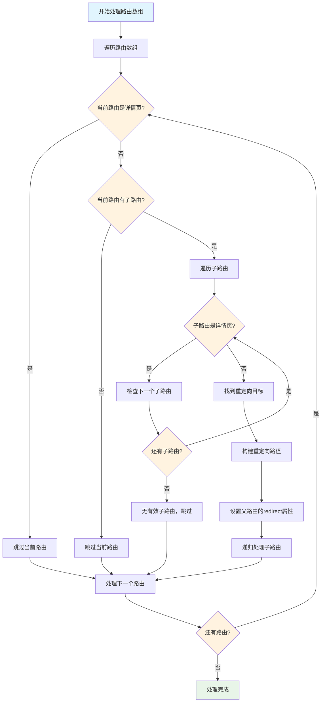

# setRedirectByRank 函数说明文档

## 📖 功能描述

`setRedirectByRank` 函数是一个用于根据路由排序配置自动设置路由重定向的工具函数。它会递归遍历已排序的路由数组，为每个具有子路由的父路由设置重定向到第一个非详情页的子路由。

### 设计目的

1. **自动化路由重定向**：减少手动配置路由重定向的工作量
2. **详情页智能跳过**：自动识别并跳过详情页（`-detail-page` 标识的路由）
3. **基于排序的重定向**：利用已排序的路由数组，确保重定向到优先级最高的子路由
4. **递归处理**：支持多层嵌套路由结构的重定向设置

## 🔧 函数签名

```typescript
function setRedirectByRank(autoRoutesParams: RouteRecordRaw[]): void;
```

### 参数说明

| 参数名             | 类型               | 描述                                                   |
| ------------------ | ------------------ | ------------------------------------------------------ |
| `autoRoutesParams` | `RouteRecordRaw[]` | 已排序的路由数组，通常由 `sortRoutes` 函数处理后的路由 |

### 返回值

无返回值（`void`）。函数直接修改传入的路由数组。

## 🎯 核心逻辑

### 处理流程

1. **递归遍历**：遍历传入的路由数组
2. **详情页检查**：使用 `isRoutePathDetailPage` 函数检查当前路由是否为详情页
3. **子路由检查**：检查当前路由是否有子路由
4. **非详情页查找**：在子路由中查找第一个非详情页路由
5. **重定向设置**：为父路由设置重定向到找到的子路由
6. **递归处理**：对子路由重复执行相同的处理逻辑

### 详情页识别规则

- 路径包含 `-detail-page` 标识的路由被识别为详情页
- 详情页路由本身不会设置重定向
- 在查找重定向目标时会跳过详情页子路由

## 📚 使用案例

### 基础用法

```typescript
import { setRedirectByRank } from "@/router/rank";
import type { RouteRecordRaw } from "vue-router";

// 已排序的路由数组
const sortedRoutes: RouteRecordRaw[] = [
	{
		path: "/management",
		name: "Management",
		children: [
			{
				path: "user",
				name: "UserManagement",
				children: [
					{
						path: "list",
						name: "UserList",
						component: () => import("@/pages/user/list.vue"),
					},
					{
						path: "create",
						name: "UserCreate",
						component: () => import("@/pages/user/create.vue"),
					},
				],
			},
		],
	},
];

// 设置重定向
setRedirectByRank(sortedRoutes);

// 结果：
// sortedRoutes[0].redirect = '/management/user'
// sortedRoutes[0].children[0].redirect = '/management/user/list'
```

### 跳过详情页的用法

```typescript
const routesWithDetailPages: RouteRecordRaw[] = [
	{
		path: "/users",
		name: "Users",
		children: [
			{
				path: "detail-page", // 详情页，会被跳过
				name: "UserDetailPage",
				component: () => import("@/pages/user/detail.vue"),
			},
			{
				path: "list", // 第一个非详情页，会被选为重定向目标
				name: "UserList",
				component: () => import("@/pages/user/list.vue"),
			},
			{
				path: "create",
				name: "UserCreate",
				component: () => import("@/pages/user/create.vue"),
			},
		],
	},
];

setRedirectByRank(routesWithDetailPages);

// 结果：
// routesWithDetailPages[0].redirect = '/users/list'
```

### 与 sortRoutes 函数结合使用

```typescript
import { sortRoutes, setRedirectByRank } from "@/router/rank";

// 1. 先排序路由
const routes = sortRoutes(autoRoutes);

// 2. 再设置重定向
setRedirectByRank(routes);

// 这样确保重定向指向排序后的第一个子路由
```

## 🔄 业务处理流程图



## ⚙️ 实现细节

### 路径构建逻辑

函数在构建重定向路径时会：

1. **处理根路径**：如果父路由路径为 `/`，则重定向路径为 `/${子路由路径}`
2. **拼接路径**：否则重定向路径为 `${父路由路径}/${子路由路径}`
3. **清理重复斜杠**：使用正则表达式 `/\/+/g` 清理路径中的重复斜杠

### 错误处理

- **空数组处理**：如果传入空数组，函数会安全返回，不会抛出错误
- **缺少路径处理**：如果子路由没有 `path` 属性，会自动跳过
- **空路径处理**：如果子路由路径为空字符串，会跳过该子路由

## 🚨 注意事项

1. **输入要求**：传入的路由数组应该是已经排序的，通常由 `sortRoutes` 函数处理
2. **直接修改**：函数直接修改传入的路由数组，不返回新数组
3. **详情页标识**：确保详情页路由路径包含 `-detail-page` 标识
4. **执行顺序**：建议在路由排序之后执行，确保重定向到优先级最高的子路由

## 🧪 测试用例

函数包含完整的测试用例，覆盖以下场景：

- ✅ 基础重定向设置
- ✅ 详情页跳过逻辑
- ✅ 多层嵌套路由处理
- ✅ 边界情况处理（空数组、空路径等）
- ✅ 路径构建和清理
- ✅ 实际业务场景模拟

测试文件位置：`apps/admin/src/router/rank/tests/setRedirectByRank.test.ts`

## 📈 性能特点

- **时间复杂度**：O(n)，其中 n 是所有路由节点的总数
- **空间复杂度**：O(d)，其中 d 是路由树的最大深度（递归调用栈）
- **内存使用**：直接修改原数组，不创建新的数据结构

## 🔗 相关函数

- [`sortRoutes`](../index.ts) - 路由排序函数，通常在本函数之前调用
- [`isRoutePathDetailPage`](../../utils.ts) - 详情页判断函数
- [`getRouteRank`](../getRouteRank.ts) - 路由排序值获取函数
