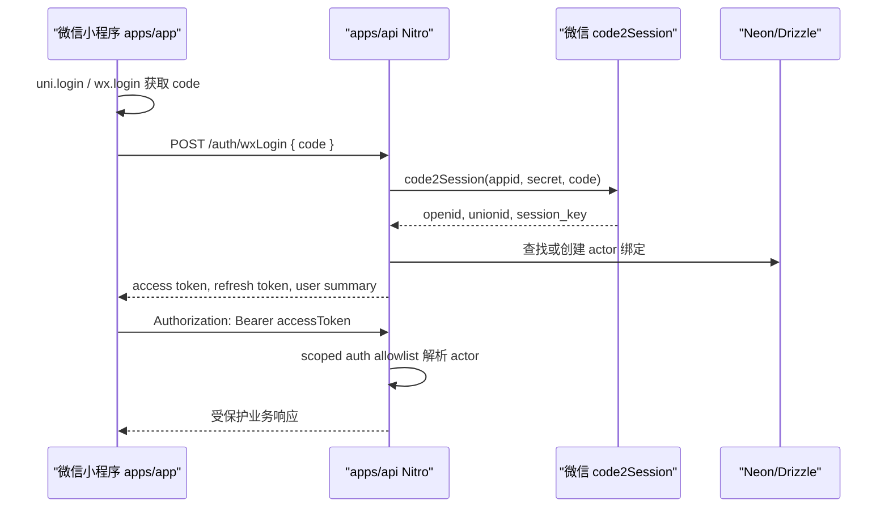
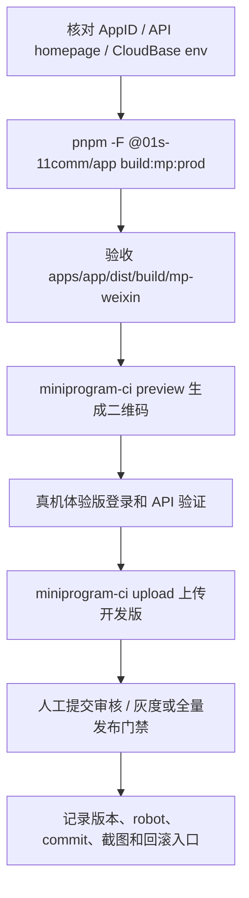

## Context

`apps/app` 是 uni-app 前端项目，`apps/app/package.json` 已有 `build:mp:prod`、`build:mp-weixin` 和 `dev:mp-weixin`，`manifest.config.ts` 已通过 `VITE_WX_APPID` 配置 `mp-weixin.appid`。生产 App H5 地址来自 `apps/app/package.json` 的 `homepage`：`https://01s-11-app.ruan-cat.com`。

`apps/api` 是独立 Nitro API 服务，生产 API 地址来自 `apps/api/package.json` 的 `homepage`：`https://01s-11-server.ruan-cat.com`。本项目的统一 API 长期目标是 admin 与 app 都消费 `apps/api`，而不是让前端项目继续内置服务端运行时。

当前风险集中在四条链路：

- 微信小程序部署链路尚未沉淀：缺少 `miniprogram-ci`/CloudBase 预览上传脚本、合法域名任务、CI secrets 约束、robot 分配和发布门禁。
- 微信登录链路尚未对齐：App 侧存在 `/auth/wxLogin`、`/auth/refreshToken`、`/auth/logout`、`/user/info` 调用，但 `apps/api` 尚未提供完整对应 route；`store/token.ts` 还存在把 `UniApp.LoginRes` 整对象传给 `{ code: string }` 接口的风险。
- 鉴权边界容易被误读：项目曾有“API 不做鉴权”的旧口径，但用户已确认 A 方案允许恢复一部分鉴权能力；新的边界是 Nitro scoped auth allowlist，普通公开路由仍默认公开，受保护 API 才要求 Bearer token。
- CloudBase 能力过宽，容易误用：CloudBase 可以操作云函数、云存储、云数据库、云托管和发布资源，但本项目已决定不把 CloudBase 作为登录主链路、主 API、主数据库或主文件存储。

## Goals / Non-Goals

**Goals:**

- 建立一个未来可直接执行的 OpenSpec 任务，完成 `apps/app` 微信云小程序部署。
- 固化 A 方案：微信小程序登录、`code2Session`、token 签发、refresh、logout、me、Bearer scoped auth、actor/role/tenant context 和受保护业务 API 都放在统一 `apps/api` Nitro。
- 明确 CloudBase 只做小程序云开发环境关联、预览/上传/发布辅助、AI/MCP/运维工具层。
- 使用项目级工具接入 `miniprogram-ci` 或 CloudBase CLI/MCP，禁止全局安装。
- 明确微信后台合法域名：request 域名使用 `https://01s-11-server.ruan-cat.com`；uploadFile/downloadFile/socket 按实际功能最小化配置。
- 保护已有 H5/Vercel 构建与部署链路，尤其是 Windows loader、`.vercel/output` 搬运和禁止 `vercel.json` 的约束。
- 建立发布口径：`miniprogram-ci upload` 只代表开发版上传成功，不代表提交审核或正式发布。

**Non-Goals:**

- 不把 CloudBase 改造成业务后端，不新增 CloudBase login 云函数，不通过 CloudBase 获取 openid/session_key。
- 不以 Neon Auth 作为微信小程序登录主方案。
- 不在本任务中重建 `apps/app`，不使用 CloudBase 模板替换现有 uni-app 项目。
- 不对所有 Nitro API 做无设计全局鉴权。
- 不修改或弱化 `apps/app` H5 Vercel 部署策略，不新增任何 `vercel.json`。
- 不把 upload 成功包装成正式线上发布完成；提交审核、审核通过、灰度/全量发布必须单独验收。

## Decisions

### 1. 微信登录主链路统一放在 Nitro

决策：微信小程序端只调用 `uni.login`/`wx.login` 获取临时 `code`，再向 `apps/api` 提交 `{ code: res.code }`。`apps/api` 在服务端调用微信 `code2Session`，读取服务端环境变量中的 `WECHAT_MP_SECRET`，建立或查找本项目 actor，并签发 Nitro 自有 access token/refresh token。

理由：`code2Session` 要求服务端调用，`WECHAT_MP_SECRET` 和微信 `session_key` 不能进入前端。Nitro 作为统一 API 可以复用已有 runtimeConfig、Neon/Drizzle、日志、CORS、错误包装和未来受保护业务 API 能力。

替代方案：CloudBase 云函数承接登录。拒绝原因是它会把登录主链路、openid/session_key 获取和 token 签发从统一 Nitro 中分裂出去，破坏用户确认的 A 方案，也会让 CloudBase 从发布辅助变成主后端。

### 2. 只恢复 scoped auth，不恢复全局鉴权

决策：允许恢复一部分鉴权能力，但必须通过 Nitro scoped auth allowlist 落地。登录、refresh、logout、me 和明确受保护业务 API 可以进入 allowlist；普通 legacy `/app/**`、`/callComponent/**` 和公开业务 API 默认公开。

理由：项目历史上存在“前端不强制登录、普通接口公开”的口径，同时未来微信登录和受保护业务 API 又需要真实 actor。scoped auth 可以同时满足两边：不破坏公开路由，也为需要保护的 API 提供可验证上下文。

替代方案：全局中间件拦截所有 API。拒绝原因是会破坏 legacy app/admin 迁移、mock/fallback、公开接口和现有验证路径，且不符合“禁止无设计全局鉴权”的项目约束。

### 3. CloudBase 只做环境与发布辅助

决策：CloudBase 允许用于小程序云开发环境关联、环境查询、发布辅助、AI/MCP/运维工具；默认只允许查询类操作。任何 CloudBase 写操作必须在任务中说明资源、命令、影响范围和回滚方式。

理由：CloudBase 官方能力包含云函数、云数据库、云存储、云托管等，能力过宽；如果不划边界，后续实现者容易把主 API 或文件存储迁到 CloudBase。当前项目已有 Nitro API、Neon、R2/Worker 文件域名方向，不应引入第二套主后端。

替代方案：使用 CloudBase 云函数、云数据库或云存储作为小程序后端。拒绝原因是这会制造双后端、双数据源和双权限体系。

### 4. 小程序上传优先使用项目级 miniprogram-ci

决策：小程序构建使用 `pnpm -F @01s-11comm/app build:mp:prod`，产物目录为 `apps/app/dist/build/mp-weixin`。预览和上传优先通过项目 devDependency 中的 `miniprogram-ci` 脚本或 `pnpm dlx miniprogram-ci@2.1.31` 临时验证，不使用全局安装。

理由：`miniprogram-ci` 是微信官方推荐的 CI 上传/预览工具，适合不打开微信开发者工具的自动化场景。项目规范禁止全局安装工具包，项目级依赖或 `pnpm dlx` 更可审计。

替代方案：依赖本机微信开发者工具 CLI。保留为人工兜底，因为它需要本机 GUI 工具和安全端口，不适合作为 CI 主链路。

### 5. 合法域名按真实能力最小化配置

决策：微信后台 request 合法域名必须配置 `https://01s-11-server.ruan-cat.com`。uploadFile 只有当小程序真实使用 `uni.uploadFile`/`wx.uploadFile` 调用 Nitro 上传时才配置同域名。downloadFile 和 socket 默认不配置，除非任务中新增对应功能。

理由：微信后台配置的是域名而不是路径，且每类能力独立；预配无用域名会让验收口径变得虚假。`api.weixin.qq.com` 不应配置为 request 域名，`code2Session` 只能由 Nitro 服务端调用。

替代方案：一次性配置 request/upload/download/socket 全套域名。拒绝原因是会制造“看起来完整”的假完成状态。

### 6. H5/Vercel 链路作为保护对象

决策：微信小程序部署任务不得修改 `build:h5:prod` 的 Windows ESM loader、`build:vercel`、`.vercel/output` 搬运链路，不得新增根目录或子项目 `vercel.json`。若实现时触碰构建链，必须同时跑 H5/Vercel 回归命令。

理由：本仓库已有 Windows H5 构建 loader 和 Vercel monorepo root config 污染事故。小程序部署和 H5/Vercel 是不同发布目标，不能为了小程序脚本便利破坏现有生产入口。

替代方案：用 `vercel.json` 或改 H5 build 命令来共享配置。拒绝原因是会重演 root config 污染和 Windows ESM loader 回退风险。

## Architecture

### 登录与受保护 API 链路

### 部署与发布链路

## Risks / Trade-offs

- 微信代码上传私钥泄露 → 私钥只来自 CI secret 或本机安全路径，不提交仓库；脚本日志不得打印私钥路径内容或 secret。
- `WECHAT_MP_SECRET` 泄露到前端 → 禁止 `VITE_WECHAT_MP_SECRET`，禁止写入 `apps/app/env/**`，禁止输出到响应体和日志；构建后扫描前端产物。
- `session_key` 被误传给前端 → Nitro 响应只返回本项目自有 token 和用户摘要；`session_key` 如需保存必须服务端处理，否则不持久化。
- `miniprogram-ci upload` 被误认为正式发布 → tasks 和发布文档必须把 upload、提交审核、审核通过、发布分成不同门禁。
- CI runner IP 不在微信后台白名单 → 任务中记录 runner IP 策略；无法固定 IP 时必须说明放开白名单的风险例外。
- App 端 token 来源不一致 → 实现时统一请求拦截器 Bearer token 来源，避免 token store 和 user store 漂移。
- `urlCheck=false` 掩盖域名错误 → 真机体验版验收必须开启微信域名校验并请求 Nitro 成功。
- CloudBase 写操作误伤资源 → 默认只读查询；写操作需要独立任务、命令、目标环境、回滚步骤和人工确认。
- 旧 H5/Vercel 构建链路被顺手改坏 → 任何触碰 `apps/app/package.json` 构建脚本、Vite/uni 构建入口或 `.vercel` 搬运时必须跑 H5/Vercel 回归。

## Migration Plan

1. 基线盘点：确认 `apps/app`、`apps/api` 的 `homepage`、AppID、manifest、env、现有构建脚本、登录调用和 Nitro route 缺口。
2. 账号与密钥准备：确认微信公众平台 AppID、代码上传密钥、IP 白名单、开发者权限、CloudBase env ID、CI secret 命名和权限边界。
3. Nitro 登录主链路：实现或补齐微信登录、refresh、logout、me、scoped auth allowlist、actor context、日志脱敏和测试。
4. App 调用端迁移：修正 `uni.login` 入参、登录 API 路径、token 存储、Bearer 注入、401/refresh/logout 行为和页面入口。
5. 小程序构建与产物验收：运行 `build:mp:prod`，检查 `dist/build/mp-weixin` 和微信项目配置。
6. 预览/上传工具：接入项目级 `miniprogram-ci` 或受限 CloudBase 辅助命令，生成二维码并上传开发版。
7. 微信后台配置：配置 request 合法域名，按实际能力配置 uploadFile/downloadFile/socket。
8. 真机验收：体验版开启域名校验，验证登录、me、refresh、logout、受保护 API、普通公开 API、错误路径和日志脱敏。
9. 发布门禁：记录 upload 结果，人工提交审核与发布；如自动化审核/发布不在本轮实现，则明确人工步骤。
10. 回归和回滚：验证 H5/Vercel 保护链路，记录小程序版本回退、robot 槽位、禁用发布脚本和回退到上一开发版的流程。

## Rollback Strategy

- 小程序代码回滚：使用微信公众平台版本管理回退到上一个稳定开发版/体验版/线上版本，记录版本号、提交人、commit SHA 和 robot。
- Nitro 登录回滚：关闭或收窄 scoped auth allowlist，保留公开路由默认放行；必要时撤回 App 调用端切流。
- App 调用端回滚：通过环境变量或配置恢复到上一稳定 API base URL；不得回退到泄露 secret 或 CloudBase login 云函数方案。
- 工具链回滚：移除新 preview/upload 脚本或禁用 CI job，但保留构建脚本和文档证据。
- H5/Vercel 保护：若任何回归失败，先恢复 H5/Vercel 相关改动，再继续小程序部署任务。

## Verification Strategy

- OpenSpec：`openspec validate deploy-app-wechat-cloud-mini-program --strict`。
- App 构建：`pnpm -F @01s-11comm/app build:mp:prod`，并检查 `apps/app/dist/build/mp-weixin`。
- App 回归：若触碰构建链，运行 `pnpm -F @01s-11comm/app build:h5:prod` 与 `pnpm -F @01s-11comm/app build:vercel`。
- API：`pnpm -F @01s-11comm/api typecheck`、`pnpm -F @01s-11comm/api test`、`pnpm -F @01s-11comm/api build:node`。
- 安全扫描：扫描 `WECHAT_MP_SECRET`、`session_key`、上传私钥、`vercel.json`、全局安装命令、CloudBase login 云函数语义。
- 真机：体验版开启域名校验，验证登录、me、refresh、logout、受保护 API、公开 API 和错误响应。
