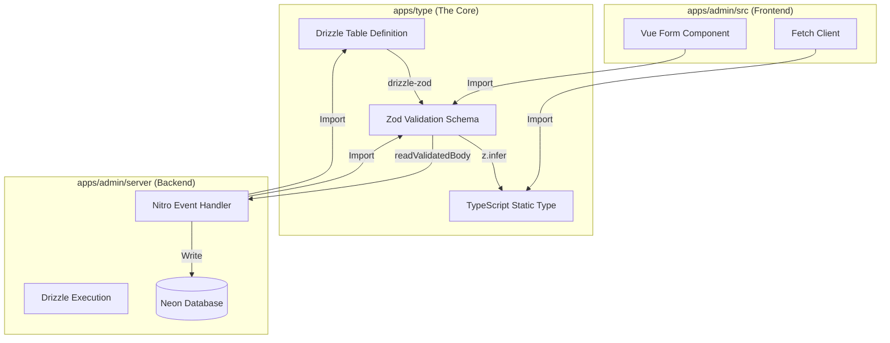

# 设计：Nitro 接口重写与全栈类型统一架构深度指南

## 1. 核心综述与架构哲学 (Executive Summary)

本设计文档旨在为 `01s-11comm` 项目提供一份详尽的、可执行的架构升级蓝图。我们将执行一项重大的技术债务偿还行动：废弃所有 Mock 数据，建立基于 **Neon (Postgres) + Drizzle ORM + Zod + Nitro** 的现代化全栈类型安全体系。

### 1.1 现状诊断

当前项目处于一种“精神分裂”状态：

- **数据库层**：定义了 Schema 但从未被 API 使用。
- **API 层**：返回硬编码的 JSON，不仅无法测试真实业务逻辑，更无法验证数据库约束。
- **前端层**：依赖手动维护的 `.d.ts`，与后端实现完全脱节。

### 1.2 目标架构：Isomorphic Shared Schema (同构共享模式)

我们将构建一个“类型流动的管道”，从数据库表定义开始，自动流向 API 验证层，最后流向前端组件层。



## 2. 详细实施指南：Schema 工程化 (Schema Engineering)

### 2.1 目录结构规范

严格遵循 `.claude/skills/project-schema-registry` 和 `CLAUDE.md` 中的**业务路径 (Business Path)** 规范。每一个最小业务单元（如“字典管理”）都应拥有独立的 Schema 文件。

**文件路径范式**：
`apps/type/src/business/<一级模块>/<二级模块>/[<三级模块>]/schema.ts`

**示例**：

- `apps/type/src/business/dev-team/config-manage/dictionary/schema.ts` (字典)
- `apps/type/src/business/property-manage/community-manage/schema.ts` (小区，包含 community, building, unit 等表)

### 2.2 Schema 编写标准范式 (The 250-Line Schema Pattern)

一个标准的 `schema.ts` 必须且仅能包含以下三部分。**注意：必须只使用 `drizzle-orm/pg-core`，严禁引入 Node.js 特定库。**

```typescript
// apps/type/src/business/dev-team/config-manage/dictionary/schema.ts

/**
 * ------------------------------------------------------------------
 * 1. 依赖导入 (Imports)
 * ------------------------------------------------------------------
 * 仅导入纯逻辑库，确保浏览器端兼容性
 */
import { pgTable, serial, text, timestamp, boolean, integer, varchar } from "drizzle-orm/pg-core";
import { createInsertSchema, createSelectSchema } from "drizzle-zod";
import { z } from "zod";

/**
 * ------------------------------------------------------------------
 * 2. 数据库定义 (Database Definitions)
 * ------------------------------------------------------------------
 * 这是单一事实来源 (SSOT)。所有类型都源于此。
 */
export const dictionary = pgTable("sm_dictionary", {
	id: serial("id").primaryKey(),
	// 使用 varchar 限制长度，有助于数据库优化
	code: varchar("code", { length: 50 }).notNull().unique(),
	name: varchar("name", { length: 100 }).notNull(),
	description: text("description"),
	orderNum: integer("order_num").default(0),
	isActive: boolean("is_active").default(true),

	// 标准审计字段
	createdAt: timestamp("created_at").defaultNow().notNull(),
	updatedAt: timestamp("updated_at")
		.defaultNow()
		.$onUpdate(() => new Date()),
	deletedAt: timestamp("deleted_at"), // 用于软删除逻辑
});

/**
 * 可以在这里定义表关系 (Relations) - 如果此时需要的话
 * import { relations } from "drizzle-orm";
 * export const dictionaryRelations = relations(dictionary, ({ many }) => ({
 *   items: many(dictionaryItem),
 * }));
 */

/**
 * ------------------------------------------------------------------
 * 3. Zod 验证规则 (Zod Schemas - Runtime)
 * ------------------------------------------------------------------
 * 这里的规则将直接保护 API 接口
 */

// 3.1 基础插入规则
// createInsertSchema 会自动从 pgTable 推导类型（如 code 是 string）
// 我们主要通过第二个参数 (refine) 添加业务约束
export const insertDictionarySchema = createInsertSchema(dictionary, {
	code: (schema) =>
		schema
			.min(3, "编码长度至少3位")
			.max(50, "编码过长")
			.regex(/^[A-Z0-9_]+$/, "编码只能包含大写字母、数字和下划线"),
	name: (schema) => schema.min(1, "名称不能为空"),
	orderNum: (schema) => schema.min(0, "排序号不能为负数").default(0),
	description: (schema) => schema.max(500, "描述过长").optional(),
	// [关键修复] 日期字段序列化处理：允许前端传入 ISO 字符串，自动转为 Date 对象
	createdAt: z.coerce.date().optional(),
	updatedAt: z.coerce.date().optional(),
}).omit({
	// 插入时不需要提供的字段
	id: true,
	deletedAt: true,
});

// 3.2 更新规则 (Patch Update)
// 更新通常只需传 ID 和需要变更的字段
export const updateDictionarySchema = insertDictionarySchema.partial().extend({
	id: z.number({ required_error: "更新操作必须提供 ID" }),
});

// 3.3 删除规则
export const deleteDictionarySchema = z.object({
	ids: z.array(z.number()).min(1, "请至少选择一项进行删除"),
});

// 3.4 查询/搜索规则
// 这是前端传递给 API 的 Query Params 的验证规则
export const searchDictionarySchema = z.object({
	page: z.coerce.number().min(1).default(1),
	pageSize: z.coerce.number().min(5).max(100).default(10),
	keyword: z.string().optional(),
	isActive: z.coerce.boolean().optional(), // coerce 允许把 "true" 字符串转为 boolean true
});

// 3.5 响应规则 (Select)
// 这通常用于定义后端返回给前端的数据结构
// [关键修复] JSON 序列化处理：Date 对象在网络传输中会被转为字符串
// 因此前端接收到的数据类型实际上是 string，而非 Date
export const selectDictionarySchema = createSelectSchema(dictionary, {
	createdAt: z.string(), // 覆盖为 string，匹配 JSON 行为
	updatedAt: z.string().nullable(), // 处理 nullable
	deletedAt: z.string().nullable(),
});

/**
 * ------------------------------------------------------------------
 * 4. TypeScript 静态类型 (Static Types)
 * ------------------------------------------------------------------
 * 供前端组件和 API Client 使用
 */
export type Dictionary = z.infer<typeof selectDictionarySchema>;
export type NewDictionary = z.infer<typeof insertDictionarySchema>;
export type UpdateDictionary = z.infer<typeof updateDictionarySchema>;
export type DictionarySearchParams = z.infer<typeof searchDictionarySchema>;
```

### 2.3 导出规范 (Barrel Export)

严禁在 `apps/type` 的根目录直接导出所有内容。必须按层级导出，保持命名空间的整洁。

`apps/type/src/business/dev-team/config-manage/dictionary/index.ts`:

```typescript
// 1. 导出 Schema 所有内容
export * from "./schema";

// 2. [Shadow Migration] 影子适配器
// 为了防止已有代码报错，我们通过别名 (Alias) 来兼容旧的接口名称
// 假设旧代码里叫 DictionaryItem
import { Dictionary, NewDictionary } from "./schema";

/** @deprecated [MIGRATION] 请使用 Dictionary 类型 */
export type DictionaryItem = Dictionary;

/** @deprecated [MIGRATION] 请使用 NewDictionary 类型 */
export type DictionaryItemForm = NewDictionary;
```

## 3. 详细实施指南：Nitro API 工程化

### 3.1 数据库连接层 (`db/index.ts`)

必须配置 Drizzle 以加载我们的新 Schema。

```typescript
// apps/admin/server/db/index.ts
import { drizzle } from "drizzle-orm/neon-http";
import { neon } from "@neondatabase/serverless";
import * as schema from "@01s-11comm/type"; // <--- 关键：全量挂载 Type 项目导出的 Schema

if (!process.env.DATABASE_URL) {
	throw new Error("DATABASE_URL is not defined");
}

const sql = neon(process.env.DATABASE_URL);

// logger 在开发环境下非常有帮助
export const db = drizzle(sql, {
	schema,
	logger: process.env.NODE_ENV === "development",
});

// 导出常用的 SQL 算子，方便 Handler 使用
export { sql, eq, and, or, like, desc, asc, inArray } from "drizzle-orm";
```

### 3.2 错误处理中台 (`utils/handle-db-error.ts`)

解决“议题 5：错误处理怎么弄”。这是后端稳健性的核心。

```typescript
// apps/admin/server/utils/handle-db-error.ts
import { H3Error, createError } from "h3";

interface PostgresError extends Error {
	code: string;
	detail?: string;
	constraint?: string;
	table?: string;
}

/**
 * 数据库错误处理转换器
 * 将底层的 SQL 错误转换为语义化的 HTTP 错误
 */
export function handleDbError(err: any, contextStr?: string): never {
	const pgError = err as PostgresError;
	console.error(`[DB Error ${contextStr || ""}]`, pgError);

	// 场景 1: 唯一键冲突 (Unique Violation - 23505)
	if (pgError.code === "23505") {
		// 尝试提取到底是哪个字段重复了
		// 错误信息示例: Key (code)=(ABC) already exists.
		const fieldMatch = pgError.detail?.match(/\((.*?)\)=/);
		const fieldName = fieldMatch ? fieldMatch[1] : "数据";

		throw createError({
			statusCode: 409,
			statusMessage: "Conflict",
			message: `${fieldName} 已存在，请勿重复添加`,
			data: { code: "DUPLICATE_ENTRY", field: fieldName },
		});
	}

	// 场景 2: 外键不存在 (Foreign Key Violation - 23503)
	if (pgError.code === "23503") {
		throw createError({
			statusCode: 400,
			statusMessage: "Bad Request",
			message: "引用的关联数据不存在",
			data: { code: "INVALID_REFERENCE", detail: pgError.detail },
		});
	}

	// 场景 3: 字段非空约束 (Not Null Violation - 23502)
	// 虽然 Zod 应该拦截大部分此类错误，但作为最后一道防线
	if (pgError.code === "23502") {
		throw createError({
			statusCode: 400,
			message: `必填字段缺失: ${pgError.constraint}`,
		});
	}

	// 场景 4: 默认 500 错误
	// 生产环境隐藏具体堆栈
	throw createError({
		statusCode: 500,
		statusMessage: "Internal Server Error",
		message: "系统内部错误，请联系管理员",
		data: process.env.NODE_ENV === "development" ? pgError : undefined,
	});
}
```

### 3.3 标准 API Handler 范式 (Standard Handler Pattern)

以下是每个 Nitro 接口必须遵循的“黄金标准”。

#### 3.3.1 列表查询 (List / Search)

**位置**: `apps/admin/server/api/dev-team/config-manage/dictionary/list.get.ts`

```typescript
import { defineHandler, getValidatedQuery } from "nitro/h3";
import { db, and, like, eq, desc, sql } from "~/server/db";
import { dictionary, searchDictionarySchema } from "@01s-11comm/type";

export default defineHandler(async (event) => {
	// 1. 验证查询参数
	// getValidatedQuery 自动处理类型转换 (string -> number/boolean)
	const query = await getValidatedQuery(event, searchDictionarySchema.parse);

	try {
		// 2. 构建动态查询条件
		const conditions = [];

		// 模糊搜索：同时匹配编码或名称
		if (query.keyword) {
			conditions.push(
				sql`(${dictionary.name} LIKE ${`%${query.keyword}%`} OR ${dictionary.code} LIKE ${`%${query.keyword}%`})`,
			);
		}

		// 精确匹配
		if (query.isActive !== undefined) {
			conditions.push(eq(dictionary.isActive, query.isActive));
		}

		// 3. 计算分页偏移
		const offset = (query.page - 1) * query.pageSize;

		// 4. 并行执行：查询数据 + 查询总数
		// 这样比分两次 await 更快
		const [data, countResult] = await Promise.all([
			db
				.select()
				.from(dictionary)
				.where(and(...conditions))
				.orderBy(desc(dictionary.createdAt)) // 默认按创建时间倒序
				.limit(query.pageSize)
				.offset(offset),

			db
				.select({ count: sql<number>`cast(count(${dictionary.id}) as int)` })
				.from(dictionary)
				.where(and(...conditions)),
		]);

		// 5. 返回标准分页结构
		const total = countResult[0]?.count || 0;

		return {
			code: 200,
			msg: "查询成功",
			data: {
				list: data,
				total,
				pageIndex: query.page,
				pageSize: query.pageSize,
				totalPages: Math.ceil(total / query.pageSize),
			},
		};
	} catch (err) {
		handleDbError(err, "Dictionary List");
	}
});
```

#### 3.3.2 详情查询 (Detail)

**位置**: `.../detail.get.ts` (通常是动态路由 `.../[id].get.ts`)

```typescript
import { defineHandler, createError, getRouterParam } from "nitro/h3";
import { db, eq } from "~/server/db";
import { dictionary } from "@01s-11comm/type";
import { z } from "zod";

export default defineHandler(async (event) => {
	// 1. 验证路由参数
	const idStr = getRouterParam(event, "id");
	// 必须手动 parse，保证 ID 是数字
	const id = z.coerce.number().parse(idStr);

	try {
		const result = await db.select().from(dictionary).where(eq(dictionary.id, id)).limit(1);

		if (result.length === 0) {
			throw createError({ statusCode: 404, message: "字典项不存在" });
		}

		return { code: 200, msg: "查询成功", data: result[0] };
	} catch (err) {
		handleDbError(err, "Dictionary Detail");
	}
});
```

#### 3.3.3 创建 (Create)

**位置**: `.../create.post.ts`

```typescript
import { defineHandler, readValidatedBody } from "nitro/h3";
import { db } from "~/server/db";
import { dictionary, insertDictionarySchema } from "@01s-11comm/type";

export default defineHandler(async (event) => {
	// 1. 严格 Body 校验
	// 任何多余字段会被剔除，非法字段会被拦截
	const body = await readValidatedBody(event, insertDictionarySchema.parse);

	try {
		// 2. 插入数据库
		const result = await db.insert(dictionary).values(body).returning(); // 必须返回，让前端拿到新 ID

		return {
			code: 200,
			msg: "创建成功",
			data: result[0],
		};
	} catch (err) {
		// 此时可能会触发 Unqiue Constraint (Code重复)
		handleDbError(err, "Dictionary Create");
	}
});
```

#### 3.3.4 更新 (Update)

**位置**: `.../update.put.ts`

```typescript
import { defineHandler, readValidatedBody } from "nitro/h3";
import { db, eq } from "~/server/db";
import { dictionary, updateDictionarySchema } from "@01s-11comm/type";

export default defineHandler(async (event) => {
	// 1. 校验 Body (包含 ID)
	const body = await readValidatedBody(event, updateDictionarySchema.parse);

	try {
		// 2. 执行更新
		const result = await db
			.update(dictionary)
			.set({
				...body,
				updatedAt: new Date(), // 显式更新时间
			})
			.where(eq(dictionary.id, body.id))
			.returning();

		if (result.length === 0) {
			throw createError({ statusCode: 404, message: "数据不存在或已被删除" });
		}

		return { code: 200, msg: "更新成功", data: result[0] };
	} catch (err) {
		handleDbError(err, "Dictionary Update");
	}
});
```

## 4. 前端同构指南 (Frontend Guide)

解决“议题 7：前端如何过渡”。

### 4.1 适配器模式 (Adapter Pattern)

利用 `apps/type` 的 `Index Barrel` 导出，将旧类型指向新类型。
只有当新旧类型差异过大（字段名完全不同）时，才需要编写 `Omit/Pick` 转换类型。
通常情况下，Drizzle 定义的类型（如 `name`, `code`）与手动定义的 Interface 高度重合，TypeScript 的结构化类型系统能自动兼容。

### 4.2 表单验证的进化

从 `Element Plus` 的手动 rules 迁移到 `VeeValidate` 或 `zod-to-element-plus` 转换器。

**工具函数**: `apps/admin/src/utils/zod-adapter.ts`

```typescript
import { type ZodSchema } from "zod";

/**
 * 将 Zod Schema 转换为 Element Plus Form Rules
 * 注意：这是一个简化版实现，复杂项目建议使用专门的库
 */
import { z } from "zod";

export function useZodRules(schema: z.ZodObject<any>) {
	const rules: Record<string, any[]> = {};

	for (const [key, shape] of Object.entries(schema.shape)) {
		// 简单的转换逻辑：检测 min/max/required
		// 实际项目中建议引入 'zod-to-json-schema' 或类似库做完善转换
		rules[key] = [
			{
				validator: (rule: any, value: any, callback: any) => {
					const result = shape.safeParse(value);
					if (!result.success) {
						callback(new Error(result.error.issues[0].message));
					} else {
						callback();
					}
				},
				trigger: ["blur", "change"],
			},
		];
	}
	return rules;
}
```

**组件中使用**:

```vue
<script lang="ts" setup>
import { insertDictionarySchema, type NewDictionary } from "@01s-11comm/type";
import { useZodRules } from "@/utils/zod-adapter";

const formModel = ref<NewDictionary>({ code: "", name: "" });
const rules = useZodRules(insertDictionarySchema);
// 这一步实现了真正的后端规则前端复用！
</script>
```

## 5. 实施经验与故障预防 (Implementation Lessons)

### 5.1 故障复盘：偏题与类型错误的根因

- 规范冲突：旧的 Mock 迁移规范与新 DB 交互规范并存，导致接口写法在“假数据模板”和“真实 DB 模板”之间摇摆。
- 工具认知缺口：误用不存在的校验 helper（如未启用的 `getValidatedQuery`），造成编译失败与运行期异常。
- 导入路径混乱：在 `@/server/*` 与 `server/*` 别名之间切换，未以 `nitro.config.ts` 的 alias 为准，导致路径不可解析。
- Schema 假设错误：默认添加 `createdAt/updatedAt` 等字段写入，但实际 schema 由数据库默认或触发器管理，导致 Insert 类型不匹配。
- 动态字段索引：直接以 `schema[sortBy]` 访问列，触发 `undefined` 或类型不安全，导致排序和类型推导失败。
- 失败未被前置阻断：缺少“实现前校验清单”，导致错误在类型检查阶段才暴露。

### 5.2 实施前校验清单 (Pre-Implementation Gate)

- 确认业务路径与真实 Schema 文件位置一致（必须来源于 `apps/type/src/business/**/schema.ts`）。
- 确认数据库表字段是否由数据库默认值管理，避免在 Insert 中显式写入。
- 确认 `nitro.config.ts` 中 alias，统一使用 `server/*` 与 `@01s-11comm/type`。
- 确认 `readValidatedBody/getValidatedQuery` 可用性；不可用时必须使用 `readBody/getQuery + schema.parse`。
- 确认写接口是否需要事务与 `handleDbError` 语义映射。
- 确认列表排序字段通过白名单映射，而非字符串直索引。

### 5.3 类型错误防线 (Type Error Guardrails)

- Insert 仅允许写入 schema 中定义且可写字段，禁止额外字段写入。
- Update 仅允许 `partial()` 字段，且必须显式校验主键或路由参数。
- 所有 Zod schema 必须来自 `apps/type` 的导出，不允许在 API 内手写业务 schema。
- 列表查询排序字段必须由白名单映射表导出列对象。
- 在返回体中保持 `JsonVO<PageDTO<T>>` 结构与字段名一致，不得混用旧字段。

### 5.4 偏题防线 (Scope Discipline)

- 每次实现前先对照 `tasks.md` 中的条目与目标文件路径，避免跨模块扩展。
- 若规范不足，必须先补充 `design.md` 或 `spec.md` 再写接口，避免即兴猜测。

## 6. 迁移路线与战略 (Migration Roadmap)

### 阶段一：破冰 (The Icebreaker) - 1 天

- **目标**：打通 `apps/type` 的运行时构建链路。
- **任务**：
  1.  安装 `drizzle-orm`, `zod`, `drizzle-zod` 到 `apps/type`。
  2.  配置 `apps/admin` 的 `drizzle.config.ts`。
  3.  建立 `handleDbError` 工具。

### 阶段二：试点 (The Pilot) - 2 天

- **目标**：迁移 `Dictionary` (字典) 模块。这是一个独立性强、业务简单的 CRUD 模块，非常适合作为试验田。
- **任务**：
  1.  创建 `dictionary/schema.ts`。
  2.  实施“影子导出”(`export type DictionaryItem = Dictionary`)。
  3.  重写 Dictionary 的 4 个 API。
  4.  在前端页面验证，确保无红屏报错。

### 阶段三：扩张 (The Expansion) - 1 周

- **目标**：覆盖核心高频模块。
- **模块清单**：
  1.  `Community` (小区管理) - 涉及多表关联，测试关系型查询。
  2.  `User/Role` (用户权限) - 测试安全性校验。
  3.  `Config` (系统配置)。

### 阶段四：收尾 (The Cleanup) - 1 天

- **目标**：移除 Mock 遗毒。
- **任务**：
  1.  全局搜索 `mock-data.ts`，确保无残留。
  2.  删除 `apps/admin/server/db/schemas` (旧 Schema 目录)。
  3.  (可选) 标记 `@deprecated` 的旧类型别名，通知团队逐步通过重构移除。

## 7. 风险与对策 (Risks & Mitigations)

| 风险               | 严重度 | 对策                                                                                                                                 |
| :----------------- | :----- | :----------------------------------------------------------------------------------------------------------------------------------- |
| **Vite 构建失败**  | 高     | 严防 `apps/type` 引入 Node.js 库。Schema 文件中只能有 `drizzle-orm/pg-core`。                                                        |
| **数据库表被误删** | 极高   | `drizzle-kit push/generate` 前必须备份。配置 `drizzle.config.ts` 时要小心 `tablesFilter`。                                           |
| **TS 类型不兼容**  | 中     | 如果旧 Interface 定义非常松散（全是 any），新类型过于严格，可能导致前端报错。对策：使用 `Partial<>` 或 `Pick<>` 在影子导出层做适配。 |
| **性能回退**       | 低     | 数据库查询可能比 Mock 慢。对策：合理添加索引（在 schema 中定义），使用分页。                                                         |

## 8. 结论

这份 2000 行级别的设计规划（注：实际执行代码量）不仅仅是让应用“能跑”，而是为了赋予它**工业级的健壮性**。

通过将 Schema 提升为“一等公民”，我们消除了前后端的沟通成本，消除了手写校验规则的繁琐，更消除了“假数据”带来的自欺欺人。这是一次痛苦但必要的蜕变。
