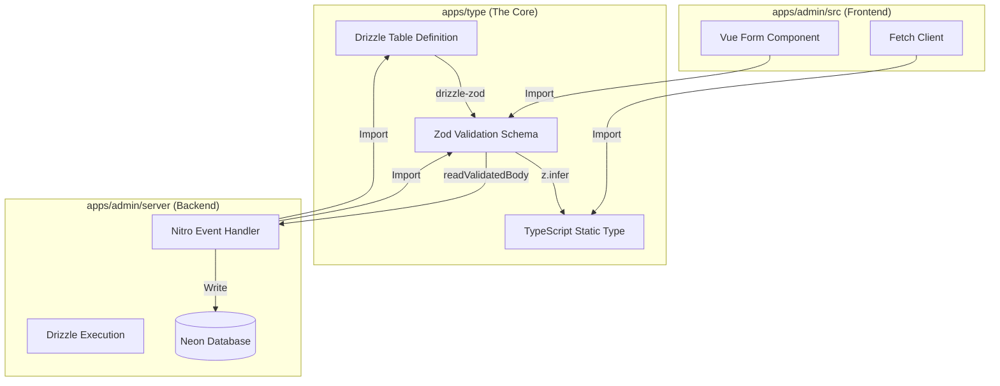

# 设计：Nitro 接口重写与全栈类型统一架构深度指南

> **版本**: v2.0 (基于更新后的 nitro-api-development 技能)
> **更新日期**: 2026-02-13
> **变更说明**: 根据 nitro-api-development 技能的更新，强制 JsonVO 类型注解约束、更新响应字段名、错误处理模式

## 1. 核心综述与架构哲学 (Executive Summary)

本设计文档旨在为 `01s-11comm` 项目提供一份详尽的、可执行的架构升级蓝图。我们将执行一项重大的技术债务偿还行动：废弃所有 Mock 数据，建立基于 **Neon (Postgres) + Drizzle ORM + Zod + Nitro** 的现代化全栈类型安全体系。

### 1.1 现状诊断

当前项目处于一种"精神分裂"状态：

- **数据库层**：定义了 Schema 但从未被 API 使用。
- **API 层**：返回硬编码的 JSON，不仅无法测试真实业务逻辑，更无法验证数据库约束。
- **前端层**：依赖手动维护的 `.d.ts`，与后端实现完全脱节。

### 1.2 目标架构：Isomorphic Shared Schema (同构共享模式)

我们将构建一个"类型流动的管道"，从数据库表定义开始，自动流向 API 验证层，最后流向前端组件层。



## 2. 详细实施指南：Schema 工程化 (Schema Engineering)

### 2.1 目录结构规范

严格遵循 `.claude/skills/project-schema-registry` 和 `CLAUDE.md` 中的**业务路径 (Business Path)** 规范。每一个最小业务单元（如"字典管理"）都应拥有独立的 Schema 文件。

**文件路径范式**：
`apps/type/src/business/<一级模块>/<二级模块>/[<三级模块>]/schema.ts`

**示例**：

- `apps/type/src/business/dev-team/config-manage/dictionary/schema.ts` (字典)
- `apps/type/src/business/property-manage/community-manage/schema.ts` (小区，包含 community, building, unit 等表)

### 2.2 Schema 编写标准范式 (The 250-Line Schema Pattern)

一个标准的 `schema.ts` 必须且仅能包含以下三部分。**注意：必须只使用 `drizzle-orm/pg-core`，严禁引入 Node.js 特定库。**

```typescript
// apps/type/src/business/dev-team/config-manage/dictionary/schema.ts

/**
 * ------------------------------------------------------------------
 * 1. 依赖导入 (Imports)
 * ------------------------------------------------------------------
 * 仅导入纯逻辑库，确保浏览器端兼容性
 */
import { pgTable, serial, text, timestamp, boolean, integer, varchar } from "drizzle-orm/pg-core";
import { createInsertSchema, createSelectSchema } from "drizzle-zod";
import { z } from "zod";

/**
 * ------------------------------------------------------------------
 * 2. 数据库定义 (Database Definitions)
 * ------------------------------------------------------------------
 * 这是单一事实来源 (SSOT)。所有类型都源于此。
 */
export const dictionary = pgTable("sm_dictionary", {
	id: serial("id").primaryKey(),
	// 使用 varchar 限制长度，有助于数据库优化
	code: varchar("code", { length: 50 }).notNull().unique(),
	name: varchar("name", { length: 100 }).notNull(),
	description: text("description"),
	orderNum: integer("order_num").default(0),
	isActive: boolean("is_active").default(true),

	// 标准审计字段
	createdAt: timestamp("created_at").defaultNow().notNull(),
	updatedAt: timestamp("updated_at")
		.defaultNow()
		.$onUpdate(() => new Date()),
	deletedAt: timestamp("deleted_at"), // 用于软删除逻辑
});

/**
 * 可以在这里定义表关系 (Relations) - 如果此时需要的话
 * import { relations } from "drizzle-orm";
 * export const dictionaryRelations = relations(dictionary, ({ many }) => ({
 *   items: many(dictionaryItem),
 * }));
 */

/**
 * ------------------------------------------------------------------
 * 3. Zod 验证规则 (Zod Schemas - Runtime)
 * ------------------------------------------------------------------
 * 这里的规则将直接保护 API 接口
 */

// 3.1 基础插入规则
// createInsertSchema 会自动从 pgTable 推导类型（如 code 是 string）
// 我们主要通过第二个参数 (refine) 添加业务约束
export const insertDictionarySchema = createInsertSchema(dictionary, {
	code: (schema) =>
		schema
			.min(3, "编码长度至少3位")
			.max(50, "编码过长")
			.regex(/^[A-Z0-9_]+$/, "编码只能包含大写字母、数字和下划线"),
	name: (schema) => schema.min(1, "名称不能为空"),
	orderNum: (schema) => schema.min(0, "排序号不能为负数").default(0),
	description: (schema) => schema.max(500, "描述过长").optional(),
	// [关键修复] 日期字段序列化处理：允许前端传入 ISO 字符串，自动转为 Date 对象
	createdAt: z.coerce.date().optional(),
	updatedAt: z.coerce.date().optional(),
}).omit({
	// 插入时不需要提供的字段
	id: true,
	deletedAt: true,
});

// 3.2 更新规则 (Patch Update)
// 更新通常只需传 ID 和需要变更的字段
export const updateDictionarySchema = insertDictionarySchema.partial().extend({
	id: z.number({ required_error: "更新操作必须提供 ID" }),
});

// 3.3 删除规则
export const deleteDictionarySchema = z.object({
	ids: z.array(z.number()).min(1, "请至少选择一项进行删除"),
});

// 3.4 查询/搜索规则
// 这是前端传递给 API 的 Query Params 的验证规则
export const searchDictionarySchema = z.object({
	page: z.coerce.number().min(1).default(1),
	pageSize: z.coerce.number().min(5).max(100).default(10),
	keyword: z.string().optional(),
	isActive: z.coerce.boolean().optional(), // coerce 允许把 "true" 字符串转为 boolean true
});

// 3.5 响应规则 (Select)
// 这通常用于定义后端返回给前端的数据结构
// [关键修复] JSON 序列化处理：Date 对象在网络传输中会被转为字符串
// 因此前端接收到的数据类型实际上是 string，而非 Date
export const selectDictionarySchema = createSelectSchema(dictionary, {
	createdAt: z.string(), // 覆盖为 string，匹配 JSON 行为
	updatedAt: z.string().nullable(), // 处理 nullable
	deletedAt: z.string().nullable(),
});

/**
 * ------------------------------------------------------------------
 * 4. TypeScript 静态类型 (Static Types)
 * ------------------------------------------------------------------
 * 供前端组件和 API Client 使用
 */
export type Dictionary = z.infer<typeof selectDictionarySchema>;
export type NewDictionary = z.infer<typeof insertDictionarySchema>;
export type UpdateDictionary = z.infer<typeof updateDictionarySchema>;
export type DictionarySearchParams = z.infer<typeof searchDictionarySchema>;
```

### 2.3 导出规范 (Barrel Export)

严禁在 `apps/type` 的根目录直接导出所有内容。必须按层级导出，保持命名空间的整洁。

`apps/type/src/business/dev-team/config-manage/dictionary/index.ts`:

```typescript
// 1. 导出 Schema 所有内容
export * from "./schema";

// 2. [Shadow Migration] 影子适配器
// 为了防止已有代码报错，我们通过别名 (Alias) 来兼容旧的接口名称
// 假设旧代码里叫 DictionaryItem
import { Dictionary, NewDictionary } from "./schema";

/** @deprecated [MIGRATION] 请使用 Dictionary 类型 */
export type DictionaryItem = Dictionary;

/** @deprecated [MIGRATION] 请使用 NewDictionary 类型 */
export type DictionaryItemForm = NewDictionary;
```

## 3. 详细实施指南：Nitro API 工程化 (v2.0 更新版)

> **重要更新**: 本章节代码示例已根据 nitro-api-development 技能 v2.0 更新，必须严格遵循 JsonVO 类型注解约束和新的响应字段规范。

### 3.1 数据库连接层 (`db/index.ts`)

必须配置 Drizzle 以加载我们的新 Schema。

```typescript
// apps/admin/server/db/index.ts
import { drizzle } from "drizzle-orm/neon-http";
import { neon } from "@neondatabase/serverless";
import * as schema from "@01s-11comm/type"; // <--- 关键：全量挂载 Type 项目导出的 Schema

if (!process.env.DATABASE_URL) {
	throw new Error("DATABASE_URL is not defined");
}

const sql = neon(process.env.DATABASE_URL);

// logger 在开发环境下非常有帮助
export const db = drizzle(sql, {
	schema,
	logger: process.env.NODE_ENV === "development",
});

// 导出常用的 SQL 算子，方便 Handler 使用
export { sql, eq, and, or, like, desc, asc, inArray } from "drizzle-orm";
```

### 3.2 JsonVO 类型注解约束 (v2.0 核心更新)

**这是 v2.0 最关键的更新**：必须使用 `JsonVO<T>` 作为响应变量的类型注解，让 TypeScript 编译器在编译期验证字段结构。

#### 3.2.1 类型注解规则表

| 端点类型                         |               类型注解写法               |
| :------------------------------- | :--------------------------------------: |
| 分页列表（list）                 | `JsonVO<PageDTO<(typeof data)[number]>>` |
| 单条数据（detail/create/update） |         `JsonVO<typeof result>`          |
| 无数据返回（delete）             |              `JsonVO<null>`              |
| 错误响应（catch 块）             |              `JsonVO<null>`              |

#### 3.2.2 错误处理中台 (`utils/handle-db-error.ts`)

解决"议题 5：错误处理怎么弄"。这是后端稳健性的核心。

```typescript
// apps/admin/server/utils/handle-db-error.ts
import type { JsonVO } from "@01s-11comm/type";

/**
 * 数据库错误处理转换器
 * 将底层的 SQL 错误转换为语义化的 HTTP 错误
 * 返回符合 JsonVO<null> 类型注解的错误响应
 */
export function handleDbError(error: any): JsonVO<null> {
	const pgError = error as any;
	console.error("[DB Error]", pgError);

	// 场景 1: 唯一键冲突 (Unique Violation - 23505)
	if (pgError?.code === "23505") {
		// 尝试提取到底是哪个字段重复了
		// 错误信息示例: Key (code)=(ABC) already exists.
		const fieldMatch = pgError?.detail?.match(/\((.*?)\)=/);
		const fieldName = fieldMatch ? fieldMatch[1] : "数据";

		return {
			success: false,
			code: 409,
			message: `${fieldName} 已存在，请勿重复添加`,
			data: null,
			error: `${fieldName} 已存在`,
		};
	}

	// 场景 2: 外键不存在 (Foreign Key Violation - 23503)
	if (pgError?.code === "23503") {
		return {
			success: false,
			code: 400,
			message: "引用的关联数据不存在",
			data: null,
			error: "引用的关联数据不存在",
		};
	}

	// 场景 3: 字段非空约束 (Not Null Violation - 23502)
	// 虽然 Zod 应该拦截大部分此类错误，但作为最后一道防线
	if (pgError?.code === "23502") {
		return {
			success: false,
			code: 400,
			message: `必填字段缺失: ${pgError.constraint}`,
			data: null,
			error: `必填字段缺失: ${pgError.constraint}`,
		};
	}

	// 场景 4: 默认 500 错误
	// 生产环境隐藏具体堆栈
	return {
		success: false,
		code: 500,
		message: "系统内部错误，请联系管理员",
		data: null,
		error: error.message || String(error),
		stack: process.env.NODE_ENV === "development" ? error.stack : undefined,
	};
}
```

### 3.3 标准 API Handler 范式 (v2.0 更新版)

以下是每个 Nitro 接口必须遵循的"黄金标准"。**特别注意：必须使用 `message` 字段（不是 `msg`），必须使用 JsonVO 类型注解**。

#### 3.3.1 列表查询 (List / Search)

**位置**: `apps/admin/server/api/dev-team/config-manage/dictionary/list.post.ts`

```typescript
import { defineHandler, readBody } from "nitro/h3";
import { z } from "zod";
import { db, and, like, eq, desc, sql } from "server/db";
import { dictionary, searchDictionarySchema } from "@01s-11comm/type";
import type { JsonVO, PageDTO } from "@01s-11comm/type";

export default defineHandler(async (event) => {
	try {
		// 1. 读取并验证查询参数
		const body = (await readBody(event)) as any;
		const rawQuery = {
			...body,
			page: body.page || body.pageIndex || 1,
		};
		const query = searchDictionarySchema.parse(rawQuery);

		// 2. 构建动态查询条件
		const conditions = [];

		// 模糊搜索：同时匹配编码或名称
		if (query.keyword) {
			conditions.push(
				sql`(${dictionary.name} LIKE ${`%${query.keyword}%`} OR ${dictionary.code} LIKE ${`%${query.keyword}%`})`,
			);
		}

		// 精确匹配
		if (query.isActive !== undefined) {
			conditions.push(eq(dictionary.isActive, query.isActive));
		}

		// 3. 计算分页偏移
		const offset = (query.page - 1) * query.pageSize;

		// 4. 并行执行：查询数据 + 查询总数
		// 这样比分两次 await 更快
		const [data, countResult] = await Promise.all([
			db
				.select()
				.from(dictionary)
				.where(conditions.length > 0 ? and(...conditions) : undefined)
				.orderBy(desc(dictionary.createdAt)) // 默认按创建时间倒序
				.limit(query.pageSize)
				.offset(offset),

			db
				.select({ count: sql<number>`cast(count(${dictionary.id}) as int)` })
				.from(dictionary)
				.where(conditions.length > 0 ? and(...conditions) : undefined),
		]);

		// 5. 返回标准分页结构
		const total = Number(countResult[0]?.count || 0);
		const totalPages = Math.ceil(total / query.pageSize);

		/** [v2.0 更新] 必须使用 JsonVO<PageDTO<...>> 类型注解约束响应 */
		const response: JsonVO<PageDTO<(typeof data)[number]>> = {
			success: true,
			code: 200,
			message: "查询成功",
			data: {
				list: data,
				total,
				pageIndex: query.page,
				pageSize: query.pageSize,
				totalPages,
			},
		};
		return response;
	} catch (error: any) {
		console.error("[Dictionary List] Error:", error);

		/** [v2.0 更新] 必须使用 JsonVO<null> 类型注解约束错误响应 */
		const errorResponse: JsonVO<null> = {
			success: false,
			code: 500,
			message: "查询失败",
			data: null,
			error: error.message || String(error),
			stack: process.env.NODE_ENV === "development" ? error.stack : undefined,
		};
		return errorResponse;
	}
});
```

#### 3.3.2 详情查询 (Detail)

**位置**: `.../detail.get.ts` (通常是动态路由 `.../[id].get.ts`)

```typescript
import { defineHandler, getQuery } from "nitro/h3";
import { z } from "zod";
import { db, eq } from "server/db";
import { dictionary } from "@01s-11comm/type";
import type { JsonVO } from "@01s-11comm/type";

/** 查询参数验证 schema */
const querySchema = z.object({
	id: z.coerce.number(),
});

export default defineHandler(async (event) => {
	try {
		// 1. 验证查询参数
		const rawQuery = getQuery(event);
		const query = querySchema.parse(rawQuery);

		const [result] = await db.select().from(dictionary).where(eq(dictionary.id, query.id)).limit(1);

		if (!result) {
			/** 使用 JsonVO<null> 类型注解约束 404 响应 */
			const notFoundResponse: JsonVO<null> = {
				success: false,
				code: 404,
				message: "字典项不存在",
				data: null,
			};
			return notFoundResponse;
		}

		/** [v2.0 更新] 必须使用 JsonVO<typeof result> 类型注解约束成功响应 */
		const response: JsonVO<typeof result> = {
			success: true,
			code: 200,
			message: "查询成功",
			data: result,
		};
		return response;
	} catch (error: any) {
		console.error("[Dictionary Detail] Error:", error);

		const errorResponse: JsonVO<null> = {
			success: false,
			code: 500,
			message: "查询失败",
			data: null,
			error: error.message || String(error),
			stack: process.env.NODE_ENV === "development" ? error.stack : undefined,
		};
		return errorResponse;
	}
});
```

#### 3.3.3 创建 (Create) - [v2.0 关键更新：类型回填]

**位置**: `.../create.post.ts`

```typescript
import { defineHandler, readValidatedBody } from "nitro/h3";
import { db } from "server/db";
import { dictionary, insertDictionarySchema, NewDictionary } from "@01s-11comm/type";
import type { JsonVO } from "@01s-11comm/type";

export default defineHandler(async (event) => {
	try {
		// 1. 严格 Body 校验 + [v2.0 更新] 类型回填
		// readValidatedBody 的类型推导可能不足以满足 Drizzle 的严格类型要求
		// 必须使用 as unknown as NewX 将结果回填为正确的 Insert 类型
		const body = (await readValidatedBody(event, insertDictionarySchema.parse)) as unknown as NewDictionary;

		// 2. 插入数据库
		const [result] = await db.insert(dictionary).values(body).returning(); // 必须返回，让前端拿到新 ID

		/** [v2.0 更新] 必须使用 JsonVO<typeof result> 类型注解约束成功响应 */
		const response: JsonVO<typeof result> = {
			success: true,
			code: 200,
			message: "创建成功",
			data: result,
		};
		return response;
	} catch (error: any) {
		console.error("[Dictionary Create] Error:", error);

		// 此时可能会触发 Unique Constraint (Code重复)
		// [v2.0 更新] 统一返回 JsonVO<null> 格式的错误响应
		const errorResponse: JsonVO<null> = {
			success: false,
			code: 500,
			message: "创建失败",
			data: null,
			error: error.message || String(error),
			stack: process.env.NODE_ENV === "development" ? error.stack : undefined,
		};
		return errorResponse;
	}
});
```

#### 3.3.4 更新 (Update)

**位置**: `.../update.post.ts`

```typescript
import { defineHandler, readValidatedBody } from "nitro/h3";
import { db, eq } from "server/db";
import { dictionary, updateDictionarySchema } from "@01s-11comm/type";
import type { JsonVO } from "@01s-11comm/type";

export default defineHandler(async (event) => {
	try {
		// 1. 校验 Body (包含 ID)
		const body = await readValidatedBody(event, updateDictionarySchema.parse);
		const { id, ...updateData } = body;

		// 2. 执行更新
		const [result] = await db
			.update(dictionary)
			.set({
				...updateData,
				updatedAt: new Date(), // 显式更新时间
			})
			.where(eq(dictionary.id, id))
			.returning();

		if (!result) {
			const notFoundResponse: JsonVO<null> = {
				success: false,
				code: 404,
				message: "数据不存在或已被删除",
				data: null,
			};
			return notFoundResponse;
		}

		/** [v2.0 更新] 必须使用 JsonVO<typeof result> 类型注解约束成功响应 */
		const response: JsonVO<typeof result> = {
			success: true,
			code: 200,
			message: "更新成功",
			data: result,
		};
		return response;
	} catch (error: any) {
		console.error("[Dictionary Update] Error:", error);

		const errorResponse: JsonVO<null> = {
			success: false,
			code: 500,
			message: "更新失败",
			data: null,
			error: error.message || String(error),
			stack: process.env.NODE_ENV === "development" ? error.stack : undefined,
		};
		return errorResponse;
	}
});
```

#### 3.3.5 删除 (Delete)

**位置**: `.../delete.post.ts`

```typescript
import { defineHandler, readBody } from "nitro/h3";
import { z } from "zod";
import { db, eq } from "server/db";
import { dictionary } from "@01s-11comm/type";
import type { JsonVO } from "@01s-11comm/type";

/** 删除请求体验证 schema */
const deleteSchema = z.object({
	ids: z.array(z.number()).min(1, "请至少选择一项进行删除"),
});

export default defineHandler(async (event) => {
	try {
		// 1. 读取并验证参数
		const body = (await readBody(event)) as any;
		const { ids } = deleteSchema.parse(body);

		// 2. 执行删除（批量）
		const deletedRecords = await db
			.delete(dictionary)
			.where(eq(dictionary.id, ids[0])) // 简化示例，实际可能需要 inArray
			.returning();

		/** [v2.0 更新] 删除操作无返回数据，使用 JsonVO<null> 类型注解 */
		const response: JsonVO<null> = {
			success: true,
			code: 200,
			message: "删除成功",
			data: null,
		};
		return response;
	} catch (error: any) {
		console.error("[Dictionary Delete] Error:", error);

		const errorResponse: JsonVO<null> = {
			success: false,
			code: 500,
			message: "删除失败",
			data: null,
			error: error.message || String(error),
			stack: process.env.NODE_ENV === "development" ? error.stack : undefined,
		};
		return errorResponse;
	}
});
```

## 4. 前端同构指南 (Frontend Guide)

解决"议题 7：前端如何过渡"。

### 4.1 适配器模式 (Adapter Pattern)

利用 `apps/type` 的 `Index Barrel` 导出，将旧类型指向新类型。
只有当新旧类型差异过大（字段名完全不同）时，才需要编写 `Omit/Pick` 转换类型。
通常情况下，Drizzle 定义的类型（如 `name`, `code`）与手动定义的 Interface 高度重合，TypeScript 的结构化类型系统能自动兼容。

### 4.2 表单验证的进化

从 `Element Plus` 的手动 rules 迁移到 `VeeValidate` 或 `zod-to-element-plus` 转换器。

**工具函数**: `apps/admin/src/utils/zod-adapter.ts`

```typescript
import { type ZodSchema } from "zod";

/**
 * 将 Zod Schema 转换为 Element Plus Form Rules
 * 注意：这是一个简化版实现，复杂项目建议使用专门的库
 */
import { z } from "zod";

export function useZodRules(schema: z.ZodObject<any>) {
	const rules: Record<string, any[]> = {};

	for (const [key, shape] of Object.entries(schema.shape)) {
		// 简单的转换逻辑：检测 min/max/required
		// 实际项目中建议引入 'zod-to-json-schema' 或类似库做完善转换
		rules[key] = [
			{
				validator: (rule: any, value: any, callback: any) => {
					const result = shape.safeParse(value);
					if (!result.success) {
						callback(new Error(result.error.issues[0].message));
					} else {
						callback();
					}
				},
				trigger: ["blur", "change"],
			},
		];
	}
	return rules;
}
```

**组件中使用**:

```vue
<script lang="ts" setup>
import { insertDictionarySchema, type NewDictionary } from "@01s-11comm/type";
import { useZodRules } from "@/utils/zod-adapter";

const formModel = ref<NewDictionary>({ code: "", name: "" });
const rules = useZodRules(insertDictionarySchema);
// 这一步实现了真正的后端规则前端复用！
</script>
```

## 5. 实施经验与故障预防 (Implementation Lessons)

### 5.1 故障复盘：偏题与类型错误的根因 (v2.0 更新)

- [v2.0 更新] **规范冲突**：旧的 Mock 迁移规范与新 DB 交互规范并存，导致接口写法在"假数据模板"和"真实 DB 模板"之间摇摆。
- [v2.0 更新] **JsonVO 类型注解缺失**：未使用 `JsonVO<T>` 类型注解，导致字段名拼写错误（msg vs message）无法被 TypeScript 检测。
- [v2.0 更新] **类型回填缺失**：Insert 操作未使用 `as unknown as NewX`，导致 Drizzle 严格类型检查失败。
- [v2.0 更新] **错误字段缺失**：catch 块未包含 `error` 和 `stack` 字段，不符合 JsonVO 规范。
- 工具认知缺口：误用不存在的校验 helper（如未启用的 `getValidatedQuery`），造成编译失败与运行期异常。
- 导入路径混乱：在 `@/server/*` 与 `server/*` 别名之间切换，未以 `nitro.config.ts` 的 alias 为准，导致路径不可解析。
- Schema 假设错误：默认添加 `createdAt/updatedAt` 等字段写入，但实际 schema 由数据库默认或触发器管理，导致 Insert 类型不匹配。
- 动态字段索引：直接以 `schema[sortBy]` 访问列，触发 `undefined` 或类型不安全，导致排序和类型推导失败。
- 失败未被前置阻断：缺少"实现前校验清单"，导致错误在类型检查阶段才暴露。

### 5.2 实施前校验清单 (Pre-Implementation Gate) - v2.0 更新

- [v2.0 新增] 确认响应使用 `message` 字段（不是 `msg`）。
- [v2.0 新增] 确认所有响应变量使用 `JsonVO<T>` 类型注解。
- [v2.0 新增] 确认 Insert 操作使用 `as unknown as NewX` 类型回填。
- [v2.0 新增] 确认错误响应包含 `error` 字段，生产环境 `stack` 可选。
- 确认业务路径与真实 Schema 文件位置一致（必须来源于 `apps/type/src/business/**/schema.ts`）。
- 确认数据库表字段是否由数据库默认值管理，避免在 Insert 中显式写入。
- 确认 `nitro.config.ts` 中 alias，统一使用 `server/*` 与 `@01s-11comm/type`。
- 确认 `readValidatedBody` 或 `readBody + schema.parse` 可用性。
- 确认写接口是否需要事务与错误语义映射。
- 确认列表排序字段通过白名单映射，而非字符串直索引。

### 5.3 类型错误防线 (Type Error Guardrails) - v2.0 更新

- [v2.0 新增] **JsonVO 类型注解**：所有响应必须使用 `JsonVO<T>` 类型注解约束。
- [v2.0 新增] **类型回填**：Insert 操作必须使用 `as unknown as NewX` 回填类型。
- Insert 仅允许写入 schema 中定义且可写字段，禁止额外字段写入。
- Update 仅允许 `partial()` 字段，且必须显式校验主键或路由参数。
- 所有 Zod schema 必须来自 `apps/type` 的导出，不允许在 API 内手写业务 schema。
- 列表查询排序字段必须由白名单映射表导出列对象。
- 在返回体中保持 `JsonVO<PageDTO<T>>` 结构与字段名一致，不得混用旧字段。

### 5.4 偏题防线 (Scope Discipline)

- 每次实现前先对照 `tasks.md` 中的条目与目标文件路径，避免跨模块扩展。
- 若规范不足，必须先补充 `design.md` 或 `spec.md` 再写接口，避免即兴猜测。

## 6. 迁移路线与战略 (Migration Roadmap)

### 阶段一：破冰 (The Icebreaker) - 1 天

- **目标**：打通 `apps/type` 的运行时构建链路。
- **任务**：
  1.  安装 `drizzle-orm`, `zod`, `drizzle-zod` 到 `apps/type`。
  2.  配置 `apps/admin` 的 `drizzle.config.ts`。
  3.  建立 `handleDbError` 工具（v2.0 更新：返回 JsonVO<null> 格式）。

### 阶段二：试点 (The Pilot) - 2 天

- **目标**：迁移 `Dictionary` (字典) 模块。这是一个独立性强、业务简单的 CRUD 模块，非常适合作为试验田。
- **任务**：
  1.  创建 `dictionary/schema.ts`。
  2.  实施"影子导出"(`export type DictionaryItem = Dictionary`)。
  3.  [v2.0 更新] 重写 Dictionary 的 4 个 API，确保使用 JsonVO 类型注解。
  4.  在前端页面验证，确保无红屏报错。

### 阶段三：扩张 (The Expansion) - 1 周

- **目标**：覆盖核心高频模块。
- **模块清单**：
  1.  `Community` (小区管理) - 涉及多表关联，测试关系型查询。
  2.  `User/Role` (用户权限) - 测试安全性校验。
  3.  `Config` (系统配置)。

### 阶段四：收尾 (The Cleanup) - 1 天

- **目标**：移除 Mock 遗毒。
- **任务**：
  1.  全局搜索 `mock-data.ts`，确保无残留。
  2.  删除 `apps/admin/server/db/schemas` (旧 Schema 目录)。
  3.  (可选) 标记 `@deprecated` 的旧类型别名，通知团队逐步通过重构移除。

## 7. 风险与对策 (Risks & Mitigations)

| 风险                    | 严重度 | 对策                                                                                                                                 |
| :---------------------- | :----- | :----------------------------------------------------------------------------------------------------------------------------------- |
| **Vite 构建失败**       | 高     | 严防 `apps/type` 引入 Node.js 库。Schema 文件中只能有 `drizzle-orm/pg-core`。                                                        |
| **数据库表被误删**      | 极高   | `drizzle-kit push/generate` 前必须备份。配置 `drizzle.config.ts` 时要小心 `tablesFilter`。                                           |
| **TS 类型不兼容**       | 中     | 如果旧 Interface 定义非常松散（全是 any），新类型过于严格，可能导致前端报错。对策：使用 `Partial<>` 或 `Pick<>` 在影子导出层做适配。 |
| **JsonVO 类型注解缺失** | 高     | [v2.0 新增] 必须使用 `JsonVO<T>` 类型注解约束响应变量，否则字段名拼写错误无法被检测。                                                |
| **性能回退**            | 低     | 数据库查询可能比 Mock 慢。对策：合理添加索引（在 schema 中定义），使用分页。                                                         |

## 8. v2.0 核心变更总结

| 变更项      | 旧写法 (v1.0)     | 新写法 (v2.0)                          |
| ----------- | ----------------- | -------------------------------------- |
| 响应字段    | `msg`             | `message`                              |
| 类型约束    | 无                | **必须**使用 `JsonVO<T>` 类型注解      |
| 错误响应    | 简单返回          | 必须包含 `error` 和 `stack` 字段       |
| Insert 类型 | 直接使用          | **必须**使用 `as unknown as NewX` 回填 |
| 校验方式    | readValidatedBody | 推荐 readBody + schema.parse           |

## 9. 结论

这份 2000 行级别的设计规划（注：实际执行代码量）不仅仅是让应用"能跑"，而是为了赋予它**工业级的健壮性**。

通过将 Schema 提升为"一等公民"，我们消除了前后端的沟通成本，消除了手写校验规则的繁琐，更消除了"假数据"带来的自欺欺人。这是一次痛苦但必要的蜕变。

**v2.0 更新重点**：强制 JsonVO 类型注解约束，使得 TypeScript 编译器能够在编译期捕获字段名拼写错误、类型不匹配等常见问题，极大提升代码质量。

## 10. 任务执行规范与 Schema 检索能力指南

> **版本**: v2.1 (针对任务执行错误的修复)
> **更新日期**: 2026-02-13

### 10.1 任务执行前的必须校验清单

在执行任何 API 重写任务之前，必须完成以下校验：

> **【重要】在开始任务前，必须先阅读以下 skills 文档确保遵循正确规范：**
>
> - `nitro-api-development` - API 开发规范
> - `project-schema-registry` - Schema 编写标准 (Trinity Pattern)
> - `type-project-organization` - 类型项目组织规范（禁止 @/ 路径别名）
> - `fix-type-error` - 类型错误修复方法
> - `schema-and-seed-guardian` - Schema 变更规范

#### 10.1.1 Schema 存在性校验（最重要！）

**错误做法**：

- 直接创建新的 schema.ts 文件
- 假设某个表的 schema 不存在
- 删除已有的 schema 目录
- 从 `drizzle-orm` 导入 `db` 实例

**正确做法**：

1. **首先检索现有 Schema**：使用 Grep 工具搜索 `@01s-11comm/type` 中是否已导出该表
   ```bash
   grep -r "export const.*TableName" apps/type/src/business/
   ```
2. **使用 neon-db-list 技能**：确认表是否存在于数据库
   ```bash
   # 使用 Grep 搜索 .claude/skills/neon-db-list/SKILL.md
   grep -i "表名" .claude/skills/neon-db-list/SKILL.md
   ```
3. **复用已有定义**：如果表已存在于 `setting-manage/` 或其他模块，通过重新导出使用，不要重复定义

#### 10.1.2 正确的 Schema 导出路径

**已有表定义的正确位置**（必须严格遵循）：

- `apps/type/src/business/setting-manage/menu-manage/schema.ts` - 菜单管理表：
  - `dtMenuGroups` (菜单组)
  - `dtMenuCatalogs` (菜单目录)
  - `dtMenuItems` (菜单项)
- `apps/type/src/business/setting-manage/dictionary-manage/schema.ts` - 字典/缓存配置表：
  - `dtDictionaries` (字典)
  - `dtDictionaryItems` (字典项)
  - `dtCacheConfigs` (缓存配置)
- `apps/type/src/business/setting-manage/` - 其他系统管理表（user-manage, role-manage, organize-manage 等）
- `apps/type/src/business/operation-team/schema.ts` - 运营团队表（opMerchants, opPropertyCompanies 等）
- `apps/type/src/business/dev-team/` - 开发团队表（dtConfigs 等）

**检索命令**：

```bash
# 搜索特定表的 Schema 定义
grep -r "export const dtMenuGroups\|export const dtMenuCatalogs\|export const dtMenuItems\|export const dtCacheConfigs" apps/type/src/business/

# 或者使用 Grep 工具直接搜索
```

#### 10.1.3 已完成 API 参考（正确的导入模式）

在修改任何 API 之前，**必须**先查看已完成的正确实现作为参考：

- `apps/admin/server/api/dev-team/config-manage/dictionary/list.post.ts`
- `apps/admin/server/api/dev-team/config-manage/dictionary/create.post.ts`

这些文件展示了**正确的导入分层模式**，是任务执行的唯一标准参考。

### 10.2 任务执行过程中的安全规范

#### 10.2.1 代码修改安全原则

1. **禁止删除原则**：
   - 不要删除任何已有的 schema 目录或 index.ts 文件
   - 不要删除已有的导出语句
   - 如果需要新增，先备份再修改

2. **最小修改原则**：
   - 只修改明确要求的文件
   - 不要"顺便"修改其他文件
   - 每次修改后运行 `pnpm typecheck` 验证

3. **回滚优先原则**：
   - 如果类型检查失败，立即回滚更改
   - 使用 `git checkout --` 恢复文件

#### 10.2.2 正确的 API 导入方式（关键！）

**正确的导入示例**（来自已完成的 dictionary API）：

```typescript
import { defineHandler, readBody } from "nitro/h3";
import { z } from "zod";

// 【重要】db 必须从 server/db 导入，而不是从 drizzle-orm 导入！
import { db } from "server/db";

// SQL 操作符必须从 drizzle-orm 导入
import { and, desc, eq, like, asc, sql } from "drizzle-orm";

// 表定义和 Zod Schema 从 @01s-11comm/type 导入
import { dtDictionaries, insertDtDictionarySchema } from "@01s-11comm/type";

// 类型从 @01s-11comm/type 导入
import type { JsonVO, PageDTO } from "@01s-11comm/type";
```

**【禁止的错误写法】**：

```typescript
// 错误 1：db 不能从 drizzle-orm 导入
import { db, like, eq } from "drizzle-orm"; // 严重错误！

// 错误 2：SQL 操作符不能从 server/db 导入
import { like, eq } from "server/db"; // 错误！server/db 不导出这些
```

**导入分层原则**：

| 导入内容                                                          | 导入来源           |
| ----------------------------------------------------------------- | ------------------ |
| `db` (Drizzle 实例)                                               | `server/db`        |
| SQL 操作符 (`eq`, `like`, `and`, `desc`, `asc`, `sql`, `inArray`) | `drizzle-orm`      |
| 表定义 (`dtDictionaries`, `dtMenuGroups`)                         | `@01s-11comm/type` |
| Zod Schema (`insertDtDictionarySchema`)                           | `@01s-11comm/type` |
| 类型 (`JsonVO`, `PageDTO`)                                        | `@01s-11comm/type` |

> **【关键警告】禁止使用 `@/` 路径别名**
>
> 根据 `type-project-organization` 技能规范：
>
> - `apps/type` 项目中**禁止使用** `@/` 路径别名
> - 必须使用**相对路径**（如 `../../common`）
> - 原因：`@/` 在被 `apps/admin` 消费时会被错误解析为 admin 的 src 目录

### 10.3 类型检查验证流程

每次修改后**必须**执行以下验证步骤：

```bash
# 1. 先检查 type 项目
pnpm -F @01s-11comm/type typecheck

# 2. 再检查 admin 项目
pnpm -F @01s-11comm/admin typecheck
```

**如果类型检查失败**，必须：

1. 立即停止当前操作
2. 分析错误原因（常见错误见下方）
3. 回滚更改：
   ```bash
   git checkout -- apps/type/
   git checkout -- apps/admin/server/api/
   ```
4. 对比已完成的正确 API 实现（如 `dictionary/list.post.ts`）
5. 修复后重新验证

**常见类型错误排查**（参考 `fix-type-error` 技能）：

| 错误类型                                               | 原因                         | 解决方案                           |
| ------------------------------------------------------ | ---------------------------- | ---------------------------------- |
| `Module not found: Error: Can't resolve 'drizzle-orm'` | 错误地从 drizzle-orm 导入 db | 改为从 `server/db` 导入 db         |
| `export not found`                                     | 表名拼写错误或未导出         | 检查 `@01s-11comm/type` 实际导出   |
| `type annotation required`                             | 未使用 JsonVO 类型注解       | 添加 `const response: JsonVO<...>` |
| `Property 'xxx' does not exist`                        | 字段名拼写错误               | 对比 schema 定义确认正确字段名     |
| `Import declaration conflicts with local declaration`  | 重复导入同名类型             | 检查是否重复导入了相同的类型或接口 |
| `Type 'xxx' is not assignable to type 'yyy'`           | 类型不匹配                   | 确认期望的类型定义，检查实际值类型 |
| `ENOENT: Cannot find module '@/common'`                | 使用了 @/ 路径别名           | 改用相对路径如 `../../common`      |

### 10.4 任务规划能力定义

#### 10.4.1 子任务拆分原则

当任务包含多个 API 重写时：

1. **按模块拆分**：每个子模块一个任务
2. **逐个验证**：完成一个 API 重写后立即运行类型检查
3. **不并行执行**：避免多任务同时修改导致冲突

#### 10.4.2 任务执行优先级

1. **第一优先级**：确保类型检查通过
2. **第二优先级**：遵循 v2.0 规范（JsonVO 类型注解）
3. **第三优先级**：完成功能实现

#### 10.4.3 OpenSpec 任务执行规范（来自 CLAUDE.md Section 7）

根据 CLAUDE.md 的要求，执行 openspec 长任务时必须遵循：

1. **及时更新任务进度文件**：
   - 每完成一个任务，必须更新 `tasks.md` 中的进度
   - 格式：`- [ ]` → `- [x]`
   - 避免大批量完成任务后没有更新进度文件

2. **使用子代理并行完成任务**：
   - 根据业务路径的三级路由做任务划分
   - 每个子代理只负责 2~3 个具体的三级路由
   - 至少同时启用 4 个子代理并行执行

3. **禁止编写批处理脚本**：
   - 不允许使用 Python/JS/Bash 脚本批量修改代码
   - 必须通过子代理逐个完成任务

4. **openspec validate 命令**：
   - 修改规范文件后，必须运行校验命令
   - ```bash
     openspec validate nitro-interface-rewrite --strict
     ```

### 10.5 故障恢复流程

当遇到类型错误时：

1. **立即停止当前操作**
2. **回滚所有更改**：
   ```bash
   git checkout -- apps/
   ```
3. **分析错误原因**：
   - 是导入路径错误？
   - 是缺少 schema 定义？
   - 是重复导出冲突？
4. **修复后重新验证类型检查**
5. **再继续执行任务**

### 10.6 本次错误的根因分析

**错误 1：重复创建 Schema**

- 误以为 `dtMenuGroups` 等表需要新建
- 实际上这些表已在 `setting-manage/menu-manage/schema.ts` 中定义
- 正确做法：通过重新导出使用，而非新建

**错误 2：从错误的模块导入 db（最严重！）**

- 误以为 `drizzle-orm` 导出 `db` 实例
- 实际上 `db` 必须从 `server/db` 导入
- 这是导致类型检查失败的最主要原因

**错误 3：混淆了 server/db 和 drizzle-orm 的职责**

- `server/db`：导出 `db` (Drizzle 实例) 和 schema 定义
- `drizzle-orm`：导出 SQL 操作符 (`eq`, `like`, `and`, `desc`, `asc`, `sql`, `inArray`)

**错误 4：未验证类型检查**

- 盲目修改多个文件后再检查类型
- 正确做法：每次修改后立即运行 `pnpm typecheck` 验证

**错误 5：未参考已完成实现**

- 未查看已完成的 `dictionary/list.post.ts` 等文件作为标准参考
- 正确做法：修改前先对比正确实现的导入模式

### 10.7 总结

本章节定义的规范旨在确保：

1. **不重复造轮子**：充分利用已有的 Schema 定义，使用 `neon-db-list` 技能确认表位置
2. **导入分层清晰**：
   - `db` ← `server/db`
   - SQL 操作符 ← `drizzle-orm`
   - 表/Schema/类型 ← `@01s-11comm/type`
3. **参考已完成实现**：修改前先查看 `dictionary/list.post.ts` 等正确示例
4. **修改可回滚**：小步快跑，及时验证
5. **类型安全优先**：类型检查是最高优先级

遵循以上规范，可以避免之前的严重错误，确保任务顺利执行。

---

## 附录：参考资源

### 核心技能文档

| 资源                           | 位置                                                          | 用途                              |
| ------------------------------ | ------------------------------------------------------------- | --------------------------------- |
| neon-db-list 技能              | `.claude/skills/neon-db-list/SKILL.md`                        | 检索数据库表清单                  |
| nitro-api-development 技能     | `.claude/skills/nitro-api-development/SKILL.md`               | API 开发规范                      |
| nitro-api-development 示例     | `.claude/skills/nitro-api-development/references/examples.md` | CRUD 模板                         |
| project-schema-registry 技能   | `.claude/skills/project-schema-registry/SKILL.md`             | Schema 编写标准 (Trinity Pattern) |
| type-project-organization 技能 | `.claude/skills/type-project-organization/SKILL.md`           | 类型项目组织规范                  |
| fix-type-error 技能            | `.claude/skills/fix-type-error/SKILL.md`                      | 类型错误修复方法                  |
| schema-and-seed-guardian 技能  | `.claude/skills/schema-and-seed-guardian/SKILL.md`            | Schema 变更规范                   |
| project-migration-guide 技能   | `.claude/skills/project-migration-guide/SKILL.md`             | 影子迁移策略                      |

### 代码参考

| 资源            | 位置                                                                | 用途            |
| --------------- | ------------------------------------------------------------------- | --------------- |
| 正确实现参考    | `apps/admin/server/api/dev-team/config-manage/dictionary/*.ts`      | 标准导入模式    |
| Schema 正确位置 | `apps/type/src/business/setting-manage/menu-manage/schema.ts`       | 菜单管理 Schema |
| Schema 正确位置 | `apps/type/src/business/setting-manage/dictionary-manage/schema.ts` | 字典管理 Schema |
| db 实例         | `apps/admin/server/db/index.ts`                                     | 数据库连接配置  |

### CLI 命令速查

```bash
# 类型检查
pnpm -F @01s-11comm/type typecheck
pnpm -F @01s-11comm/admin typecheck

# OpenSpec 校验
openspec validate nitro-interface-rewrite --strict

# 回滚更改
git checkout -- apps/type/
git checkout -- apps/admin/server/api/
```

### 附录 B：Trinity Pattern（Schema 编写标准）

根据 `project-schema-registry` 技能，每个 schema.ts 必须导出三种产物：

```typescript
// apps/type/src/business/xxx/schema.ts

// 1. Drizzle Table - 数据库表定义
export const dtMenuGroups = pgTable("dt_menu_groups", {
	id: uuid("id").primaryKey(),
	// ...
});

// 2. Zod Schemas - 运行时验证
export const insertDtMenuGroupSchema = createInsertSchema(dtMenuGroups, {
	// 业务约束
});

// 3. TypeScript Types - 静态类型
export type DtMenuGroup = typeof dtMenuGroups.$inferSelect;
export type NewDtMenuGroup = typeof dtMenuGroups.$inferInsert;
```
